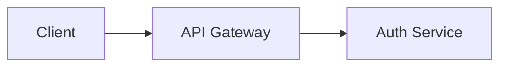

# Documentation Style Guide

> **Version**: 1.0.0  
> **Last Updated**: 2026-07-30  
> **Owner**: Technical Writing Team

---

## Purpose

This style guide ensures all DataFlow documentation is consistent, professional, and easy to maintain.

## Scope

Applies to all markdown files in the `/docs` directory and subdirectories.

## Audience

All contributors who write or modify documentation.

---

## 1. File Format

- All documentation files use **Markdown** (`.md`) format
- Machine-readable definitions use **JSON** (`.json`)
- Diagrams use **Mermaid** syntax embedded in markdown code blocks
- Files use **UTF-8** encoding with **LF** line endings

## 2. Document Header

Every document must begin with:

```markdown
# Document Title

> **Version**: X.Y.Z  
> **Last Updated**: YYYY-MM-DD  
> **Status**: Active | Draft | Deprecated | Proposed  
> **Owner**: Team or Role Name

---

## Purpose

One paragraph explaining why this document exists.

## Scope

What this document covers and what it does not cover.

## Audience

Who should read this document.
```

## 3. Headings

- Use `#` for document title (H1) — one per file
- Use `##` for major sections (H2)
- Use `###` for subsections (H3)
- Use `####` for sub-subsections (H4) — avoid going deeper
- Capitalize first letter of each word in headings (Title Case)
- Do not use `===` or `---` underline headings

## 4. Terminology

| Term | Usage |
|------|-------|
| DataFlow | Platform name (always capitalized) |
| Organization | A tenant in the platform (not "company" or "account") |
| Workspace | A user's or org's data space |
| Super Admin | Platform owner role (not "SuperAdmin" or "super admin") |
| Org Admin | Organization administrator role |
| RBAC | Role-Based Access Control (spell out on first use) |
| JWT | JSON Web Token (spell out on first use) |
| ETL | Extract, Transform, Load (spell out on first use) |
| OCR | Optical Character Recognition (spell out on first use) |
| API | Application Programming Interface (no need to spell out) |
| Frontend | The Next.js web application (one word) |
| Backend | The FastAPI server application (one word) |
| Database | The PostgreSQL database (capitalize when referring to the system) |

## 5. Code References

- Use backticks for inline code: `permission-matrix.md`
- Use fenced code blocks for multi-line code:
  ```python
  def example():
      pass
  ```
- Use the appropriate language tag for syntax highlighting
- File paths use backticks: `authentication/routes.py`
- Function/method names use backticks: `require_permissions()`

## 6. Tables

- Use markdown table syntax for structured data
- Include headers for all tables
- Keep tables concise — use lists for unstructured data
- Example:

```markdown
| Column | Type | Description |
|--------|------|-------------|
| id | BigInteger | Primary key |
```

## 7. Diagrams

- Use **Mermaid** syntax for all diagrams
- Embed in markdown code blocks with `mermaid` language tag
- Example:



- Keep diagrams readable — avoid more than 15 nodes per diagram
- Add a caption above each diagram with `**Figure X**: Description`

## 8. Cross-References

- Link to related documents at the end of each file under `## Related Documents`
- Use relative paths: `[authentication.md](../backend/authentication.md)`
- Link to source files using backtick paths: `authentication/routes.py`
- Avoid duplicating content — link instead

## 9. Status Indicators

- **Active** — Current and maintained
- **Draft** — In progress, not yet reviewed
- **Proposed** — Proposed but not yet accepted
- **Deprecated** — No longer current, kept for reference
- **Planned** — Feature not yet implemented

Mark planned features clearly:

```markdown
> **⚠️ Planned**: This feature is not yet implemented. See [ADR-0012](architecture/adr/ADR-0012-future-enterprise-readiness.md).
```

## 10. Versioning

- Each document has a version number: `MAJOR.MINOR.PATCH`
- Increment MAJOR for structural changes
- Increment MINOR for new content
- Increment PATCH for corrections
- Update `Last Updated` date on every change

## 11. Tone

- Use **active voice**: "The API returns..." not "It is returned by the API..."
- Use **present tense**: "The system supports..." not "The system will support..."
- Be **concise**: avoid unnecessary words
- Be **technical**: write for engineers, not marketing
- Be **accurate**: verify against source code before writing
