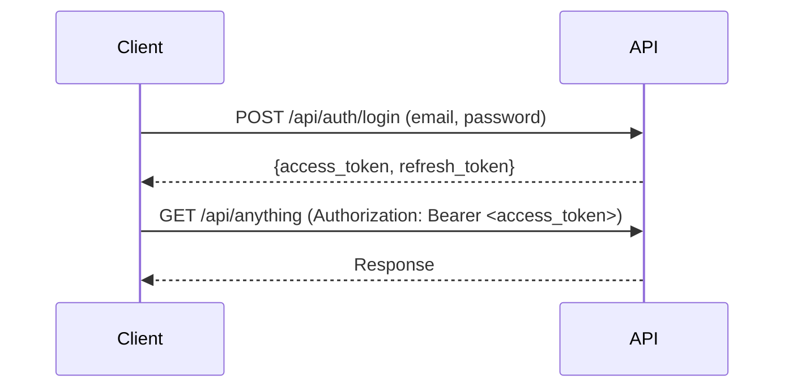

# API Authentication

> **Version**: 1.0.0  
> **Last Updated**: 2026-07-30  
> **Status**: Active  
> **Owner**: Backend Lead

---

## Purpose

How to authenticate with the DataFlow API.

## Scope

JWT token acquisition and usage for API access.

## Audience

API consumers and developers.

---

## 1. Authentication Flow



## 2. Login

```bash
curl -X POST https://api.dataflow.io/api/auth/login \
  -H "Content-Type: application/json" \
  -d '{"email": "user@example.com", "password": "secret"}'
```

Response:
```json
{
  "success": true,
  "message": "Login successful",
  "data": {
    "access_token": "eyJ...",
    "refresh_token": "abc123...",
    "user": {
      "id": 1,
      "email": "user@example.com",
      "full_name": "John Doe",
      "roles": ["org_admin"]
    }
  }
}
```

## 3. Using the Access Token

```bash
curl -X GET https://api.dataflow.io/api/users \
  -H "Authorization: Bearer eyJ..."
```

## 4. Refreshing Tokens

```bash
curl -X POST https://api.dataflow.io/api/auth/refresh \
  -H "Content-Type: application/json" \
  -d '{"refresh_token": "abc123..."}'
```

## 5. Token Lifetimes

| Token | Lifetime |
|-------|----------|
| Access token | 30 minutes |
| Refresh token | 7 days |

## 6. API Keys (Planned)

> **⚠️ Planned**: API key authentication is not yet implemented. See [ADR-0012](../architecture/adr/README.md).

## Related Documents

- [openapi.md](openapi.md) — OpenAPI spec
- [examples.md](examples.md) — API examples
- [../backend/authentication.md](../backend/authentication.md) — Backend auth
- [webhooks.md](webhooks.md) — Webhooks
