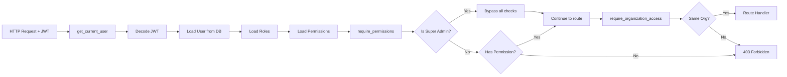
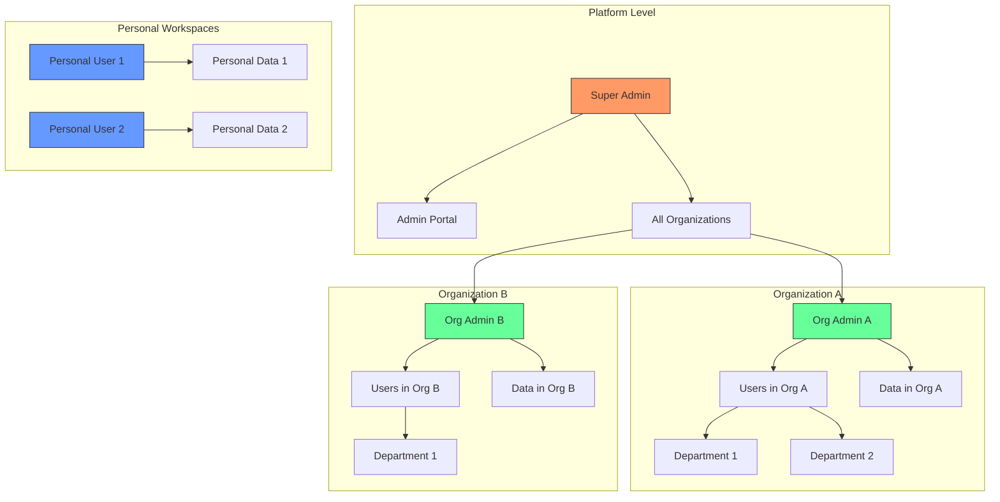

# Component Diagram

> **Version**: 1.0.0  
> **Last Updated**: 2026-07-30  
> **Status**: Active  
> **Owner**: Enterprise Architect

---

## Purpose

Visual representation of all major platform components and their relationships.

## Scope

All subsystems, external integrations, and data stores.

## Audience

Developers, architects, and new team members.

---

## 1. Full System Component Diagram

```mermaid
graph TB
    subgraph Client Layer
        Browser[Web Browser]
        APIClient[API Client / SDK]
    end

    subgraph Frontend
        NextJS[Next.js 14 App]
        AuthStore[Zustand Auth Store]
        RouteGuard[RouteGuard]
        Can[Can Component]
        Sidebar[Sidebar Nav]
        Theme[ThemeProvider]
    end

    subgraph Backend API
        FastAPI[FastAPI Server]
        AuthRouter[Auth Router]
        UserRouter[User Router]
        RoleRouter[Role Router]
        OrgRouter[Org Router]
        InvitationRouter[Invitation Router]
        AuditRouter[Audit Router]
        ETLRouter[ETL Router]
        AIRouter[AI Router]
        AnalyticsRouter[Analytics Router]
        MLRouter[ML Router]
        CaptureRouter[Capture Router]
        StudiosRouter[Studios Router]
        SaaSRouter[SaaS Router]
        ConnectorRouter[Connector Router]
        WorkflowRouter[Workflow Router]
    end

    subgraph Middleware
        CORS[CORS Middleware]
        RateLimit[Rate Limit Middleware]
        TenantIsolation[Tenant Isolation Middleware]
        SecurityHeaders[Security Headers Middleware]
        RequestLog[Request Logging Middleware]
        GZip[GZip Middleware]
        RequestContext[Request Context Middleware]
        RequestSize[Request Size Limit]
    end

    subgraph Services
        AuthService[Auth Service]
        UserService[User Service]
        RoleService[Role Service]
        InvitationService[Invitation Service]
        RegistrationService[Registration Service]
        ETLService[ETL Service]
        BackupService[Backup Service]
        ReportScheduler[Report Scheduler]
    end

    subgraph Data Layer
        PostgreSQL[(PostgreSQL)]
        Repositories[Repositories]
        ORM[SQLAlchemy ORM]
    end

    subgraph Security
        JWT[JWT Token Manager]
        PasswordHash[Password Hashing bcrypt]
        TenantContext[Tenant Context]
        TenantFilter[Tenant Filter]
        RBAC[RBAC Permission Check]
    end

    Browser --> NextJS
    APIClient --> FastAPI
    NextJS --> AuthStore
    NextJS --> RouteGuard
    NextJS --> Can
    NextJS --> Sidebar
    NextJS --> Theme

    FastAPI --> CORS
    CORS --> RateLimit
    RateLimit --> TenantIsolation
    TenantIsolation --> SecurityHeaders
    SecurityHeaders --> RequestLog
    RequestLog --> GZip
    GZip --> RequestContext
    RequestContext --> RequestSize

    FastAPI --> AuthRouter
    FastAPI --> UserRouter
    FastAPI --> RoleRouter
    FastAPI --> OrgRouter
    FastAPI --> InvitationRouter
    FastAPI --> AuditRouter
    FastAPI --> ETLRouter
    FastAPI --> AIRouter
    FastAPI --> AnalyticsRouter
    FastAPI --> MLRouter
    FastAPI --> CaptureRouter
    FastAPI --> StudiosRouter
    FastAPI --> SaaSRouter
    FastAPI --> ConnectorRouter
    FastAPI --> WorkflowRouter

    AuthRouter --> AuthService
    UserRouter --> UserService
    RoleRouter --> RoleService
    InvitationRouter --> InvitationService
    InvitationRouter --> RegistrationService
    ETLRouter --> ETLService

    AuthService --> JWT
    AuthService --> PasswordHash
    AuthService --> RBAC
    UserService --> RBAC
    OrgRouter --> TenantContext
    OrgRouter --> TenantFilter

    AuthService --> Repositories
    UserService --> Repositories
    RoleService --> Repositories
    InvitationService --> Repositories
    ETLService --> Repositories
    Repositories --> ORM
    ORM --> PostgreSQL

    ReportScheduler --> PostgreSQL
    BackupService --> PostgreSQL
```

## 2. Authentication & Authorization Component Diagram

## 3. Multi-Tenant Component Diagram

## Related Documents

- [system-design.md](system-design.md) — Detailed system design
- [overview.md](overview.md) — Architecture overview
- [data-flow.md](data-flow.md) — Data flow through the platform
- [sequence-diagrams.md](sequence-diagrams.md) — Sequence diagrams for key flows
