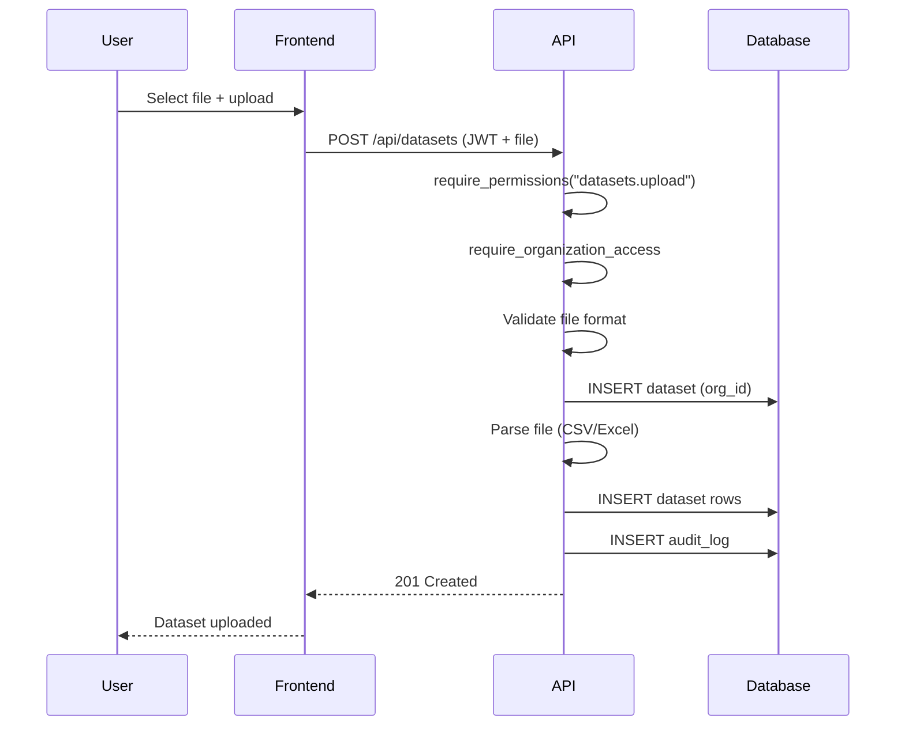
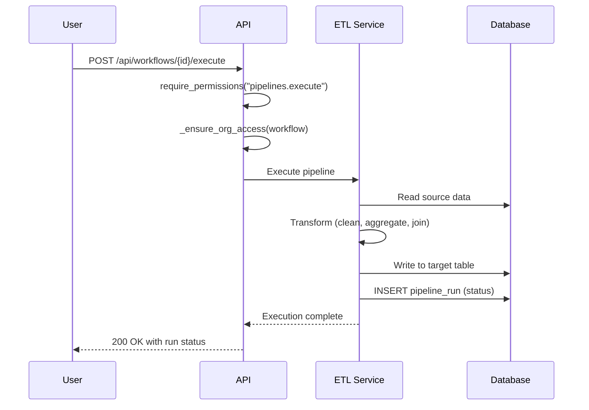
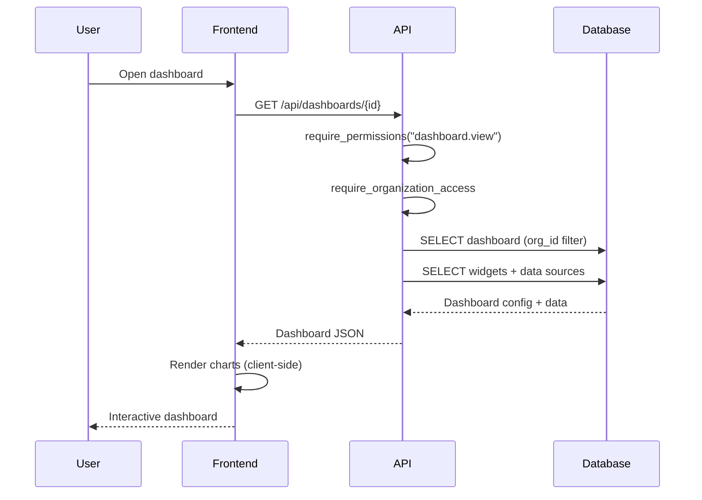
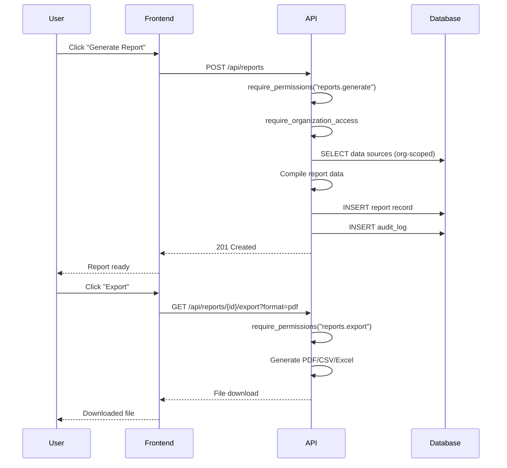
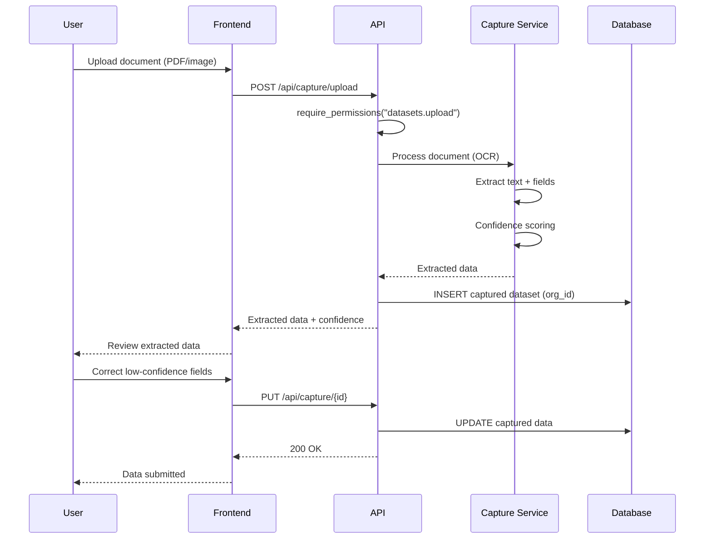
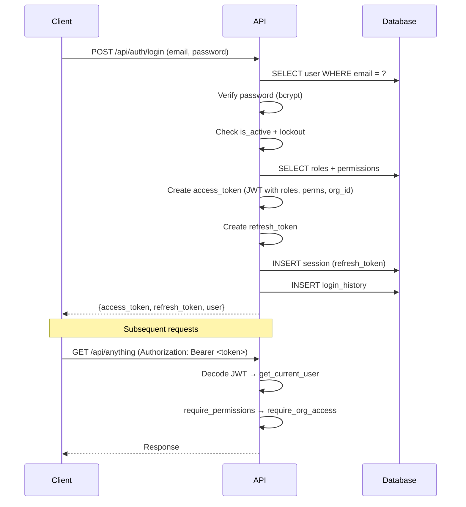
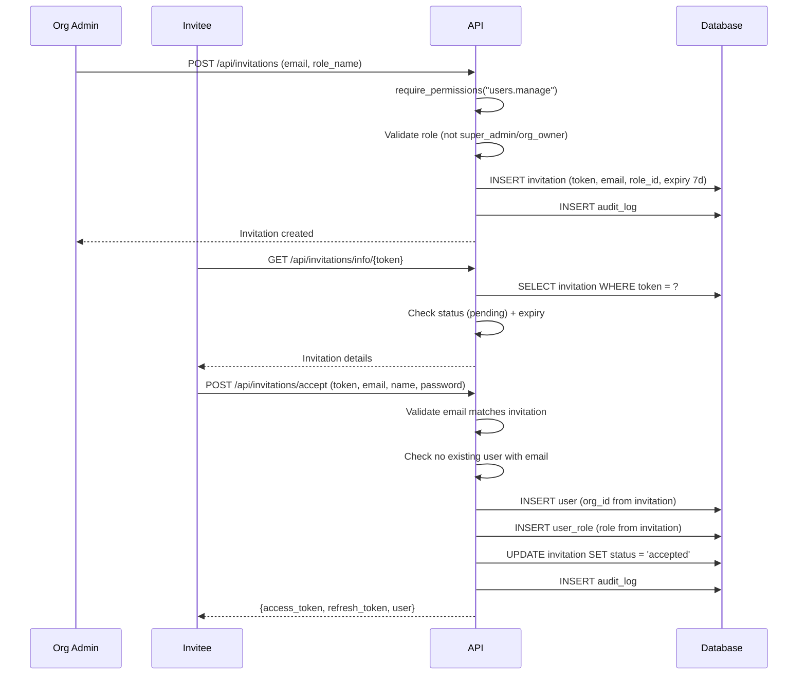

# Data Flow

> **Version**: 1.0.0  
> **Last Updated**: 2026-07-30  
> **Status**: Active  
> **Owner**: Enterprise Architect

---

## Purpose

Document how data flows through the platform from upload to report.

## Scope

All major data flows: dataset upload, ETL pipeline, dashboard generation, report generation, document capture.

## Audience

Developers, data engineers, and architects.

---

## 1. Dataset Upload Flow

## 2. ETL Pipeline Flow

## 3. Dashboard Generation Flow

## 4. Report Generation Flow

## 5. Document Capture Flow

## 6. Authentication Flow

## 7. Invitation Flow

## Related Documents

- [sequence-diagrams.md](sequence-diagrams.md) — More sequence diagrams
- [system-design.md](system-design.md) — System design details
- [../workflows/](../workflows/) — Workflow documentation
