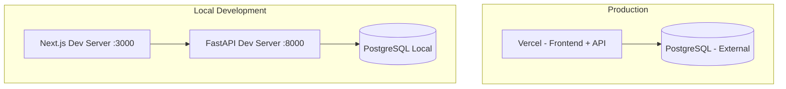

# Deployment Architecture

> **Version**: 1.0.0  
> **Last Updated**: 2026-07-30  
> **Status**: Active  
> **Owner**: DevOps Engineer

---

## Purpose

Document the deployment topology for local, staging, and production environments.

## Scope

All deployment environments, configuration, and infrastructure.

## Audience

DevOps engineers, developers, and operations team.

---

## 1. Deployment Topology

## 2. Environments

| Environment | Frontend | Backend | Database | Purpose |
|-------------|----------|---------|----------|---------|
| Local | `next dev` (port 3000) | `uvicorn` (port 8000) | Local PostgreSQL | Development |
| Production | Vercel | Vercel Serverless Functions | External PostgreSQL | Live |

## 3. Serverless Mode

When deployed on Vercel (`VERCEL=1`), the application skips:
- Database table creation (`Base.metadata.create_all`)
- Default data seeding (`seed_default_data`)
- Demo data seeding (`seed_demo_data`)
- Background scheduler startup
- Subscription initialization

These tasks must be handled by deployment hooks or run separately.

## 4. Environment Variables

| Variable | Default | Description |
|----------|---------|-------------|
| `DATABASE_URL` | — | PostgreSQL connection string (required) |
| `JWT_SECRET_KEY` | — | JWT signing secret (required) |
| `CORS_ORIGINS` | — | Comma-separated allowed origins |
| `SEED_DEMO_DATA` | `false` | Enable demo data seeding |
| `VERCEL` | — | Set to `1` on Vercel |
| `DISABLE_STARTUP_TASKS` | — | Skip heavy startup tasks |
| `RATE_LIMIT_RPM` | `120` | Rate limit per minute |
| `MAX_REQUEST_BODY_BYTES` | `52428800` | Max request body size (50MB) |
| `DEBUG` | — | Show detailed error messages |
| `PYTEST_RUNNING` | — | Disable rate limiting in tests |

## Related Documents

- [deployment/local-development.md](../deployment/local-development.md)
- [deployment/vercel.md](../deployment/vercel.md)
- [deployment/production.md](../deployment/production.md)
- [deployment/environments.md](../deployment/environments.md)
