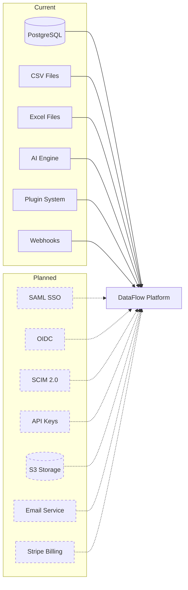

# Integrations

> **Version**: 1.0.0  
> **Last Updated**: 2026-07-30  
> **Status**: Active  
> **Owner**: Solution Architect

---

## Purpose

Document external system integration points.

## Scope

All current and planned integrations with external systems.

## Audience

Developers, solution architects, and integration engineers.

---

## 1. Current Integrations

### Database Connectors

| Connector | Status | Description |
|-----------|--------|-------------|
| PostgreSQL | ✅ Active | Direct connection via SQLAlchemy |
| CSV File Import | ✅ Active | File upload and parsing |
| Excel File Import | ✅ Active | `.xlsx` file upload and parsing |

### AI Integrations

| Integration | Status | Description |
|-------------|--------|-------------|
| AI Conversational Analytics | ✅ Active | In-platform AI assistant |
| AI Predictions | ✅ Active | ML-based predictions |
| AI Report Generation | ✅ Active | AI-assisted report summaries |

### Ecosystem

| Integration | Status | Description |
|-------------|--------|-------------|
| Plugins | ✅ Active | Plugin system for extensions |
| Webhooks | ✅ Active | Outbound webhook events |
| Marketplace | ✅ Placeholder | Extension marketplace UI exists |

### SaaS

| Integration | Status | Description |
|-------------|--------|-------------|
| Subscription Management | ✅ Active | Trial subscriptions auto-created |
| Tenant Management | ✅ Active | Suspend/activate tenants |
| Feature Flags | ✅ Active | SaaS plan-based feature gating |

## 2. Planned Integrations

> **⚠️ Planned**: These integrations are not yet implemented. See [ADR-0012](adr/ADR-0012-future-enterprise-readiness.md).

| Integration | Priority | Description |
|-------------|----------|-------------|
| SAML 2.0 SSO | Medium | Enterprise single sign-on |
| OIDC SSO | Medium | OpenID Connect authentication |
| SCIM 2.0 | Medium | Automated user provisioning |
| API Keys | High | Programmatic API access |
| Cloud Storage (S3) | Medium | Dataset storage offloading |
| Email Service | Medium | Transactional email for invitations |
| Stripe Billing | Low | Payment processing for licensing |
| White-Label | Low | Custom branding per organization |

## 3. Integration Architecture

## Related Documents

- [../integrations/](../integrations/) — Detailed integration docs
- [adr/ADR-0012-future-enterprise-readiness.md](adr/ADR-0012-future-enterprise-readiness.md) — Future enterprise features
- [technology-stack.md](technology-stack.md) — Technology stack
