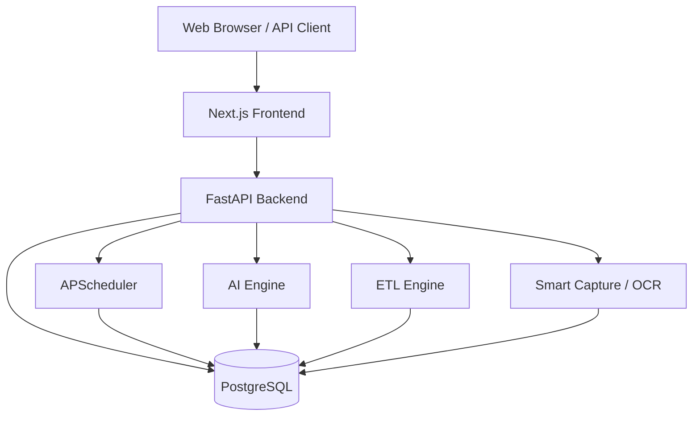
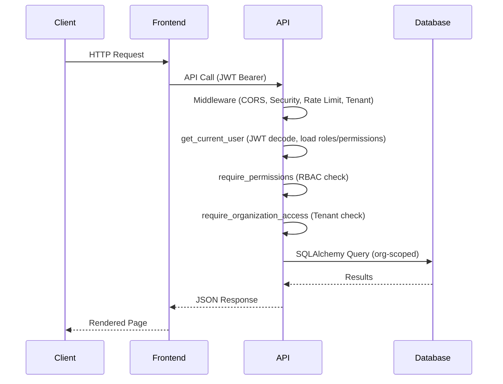

# Architecture Overview

> **Version**: 1.0.0  
> **Last Updated**: 2026-07-30  
> **Status**: Active  
> **Owner**: Enterprise Architect

---

## Purpose

High-level overview of the DataFlow platform architecture.

## Scope

Covers the overall system design, major components, and architectural principles.

## Audience

All developers, architects, and technical stakeholders.

---

## 1. Platform Summary

DataFlow is an **Enterprise Data Intelligence Platform** that provides ETL, analytics, dashboards, reporting, AI insights, and document capture for organizations across multiple industries.

The platform is a **monorepo** containing:
- **Backend**: Python FastAPI REST API server
- **Frontend**: Next.js 14 React web application
- **Database**: PostgreSQL (via SQLAlchemy ORM)

## 2. Architectural Principles

1. **Multi-tenant by design** — All data is scoped by `organization_id`
2. **RBAC enforcement on backend** — Frontend checks are UX only
3. **Blank workspace by default** — No auto-generated demo data
4. **Invitation-based onboarding** — Org membership requires admin invitation
5. **API-first** — All features accessible via REST API
6. **Serverless-ready** — Deployable on Vercel with cold-start optimizations
7. **Defense-in-depth** — Multiple layers of authorization and tenant isolation

## 3. High-Level Architecture

## 4. Major Subsystems

| Subsystem | Path | Description |
|-----------|------|-------------|
| Authentication & IAM | `authentication/` | JWT auth, users, roles, permissions |
| Organizations | `organizations/` | Orgs, departments, invitations, workspaces |
| Analytics | `analytics/` | Dashboards, KPIs, visualizations |
| ETL | `etl/` | Data pipelines, import/export |
| AI | `ai/` | Conversational analytics, predictions |
| Machine Learning | `ml/` | ML models, training, prediction |
| Smart Capture | `capture/` | Document upload, OCR, data extraction |
| Studios | `studios/` | Industry-specific modules |
| Audit | `audit/` | Audit logs, security logs |
| Notifications | `notifications/` | User notifications |
| Scheduler | `scheduler/` | Background jobs, report scheduling |
| Connectors | `connectors/` | External data source connectors |
| Ecosystem | `ecosystem/` | Plugins, webhooks, marketplace |
| SaaS | `saas/` | Tenant management, billing, subscriptions |
| Workflows | `workflows/` | ETL workflow definitions |
| Validation | `validation/` | Data validation rules |
| Dataset Library | `dataset_library/` | Dataset templates and schemas |

## 5. Request Flow

## Related Documents

- [system-design.md](system-design.md) — Detailed component design
- [component-diagram.md](component-diagram.md) — Full component diagram
- [deployment-architecture.md](deployment-architecture.md) — Deployment topology
- [technology-stack.md](technology-stack.md) — Complete tech stack
- [adr/](adr/) — Architecture Decision Records
