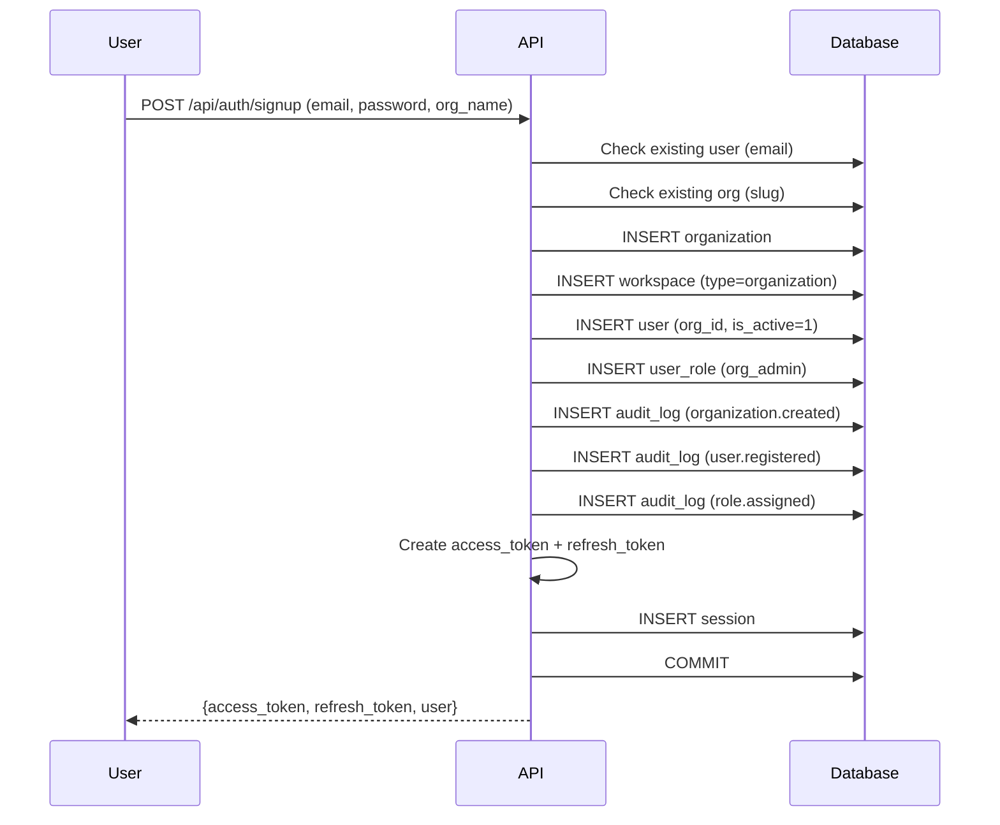
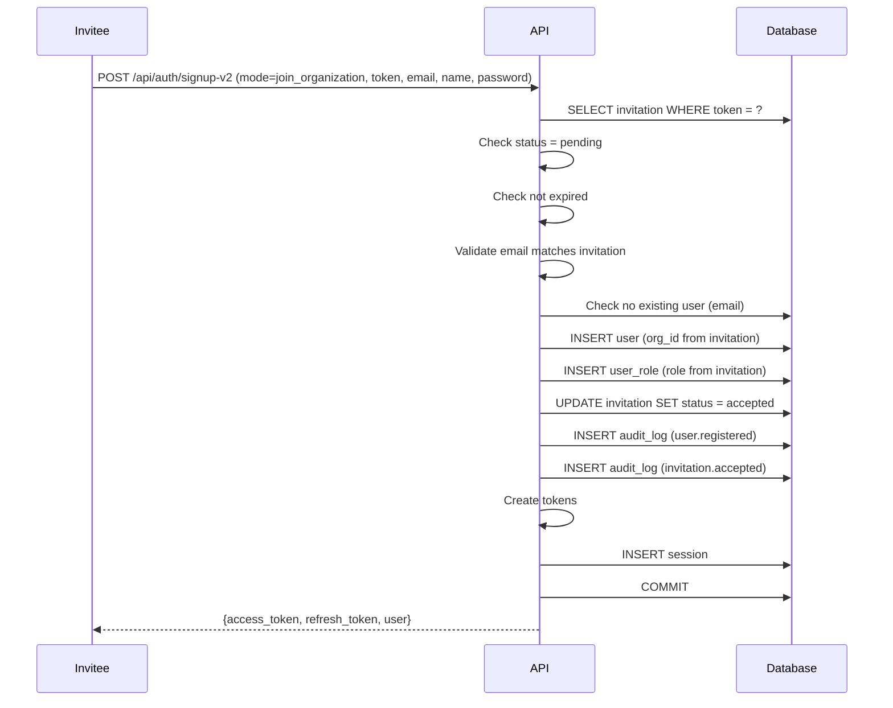
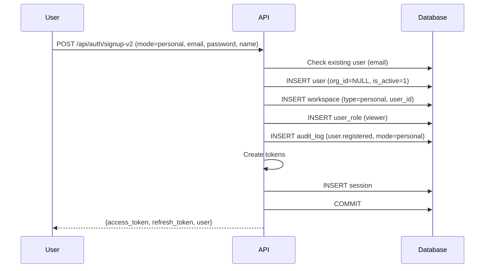
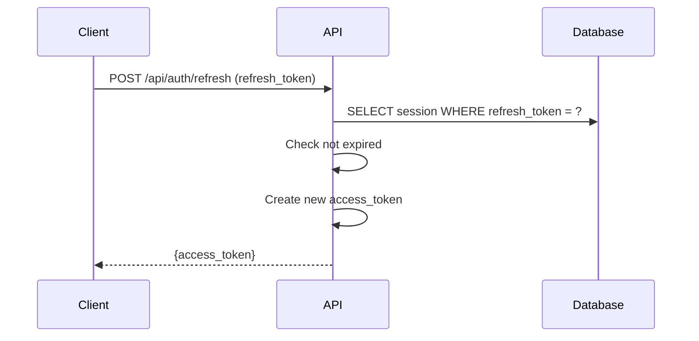
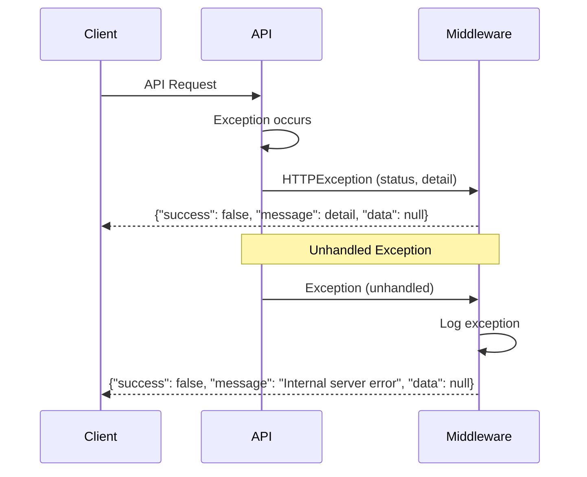

# Sequence Diagrams

> **Version**: 1.0.0  
> **Last Updated**: 2026-07-30  
> **Status**: Active  
> **Owner**: Enterprise Architect

---

## Purpose

Sequence diagrams for key platform flows.

## Scope

Authentication, registration, invitation, ETL, and error handling flows.

## Audience

Developers and architects.

---

## 1. Registration — Create Organization

## 2. Registration — Join via Invitation

## 3. Registration — Personal Workspace

## 4. Token Refresh

## 5. Error Handling

## Related Documents

- [data-flow.md](data-flow.md) — Data flow diagrams
- [system-design.md](system-design.md) — System design
- [../backend/authentication.md](../backend/authentication.md) — Authentication details
