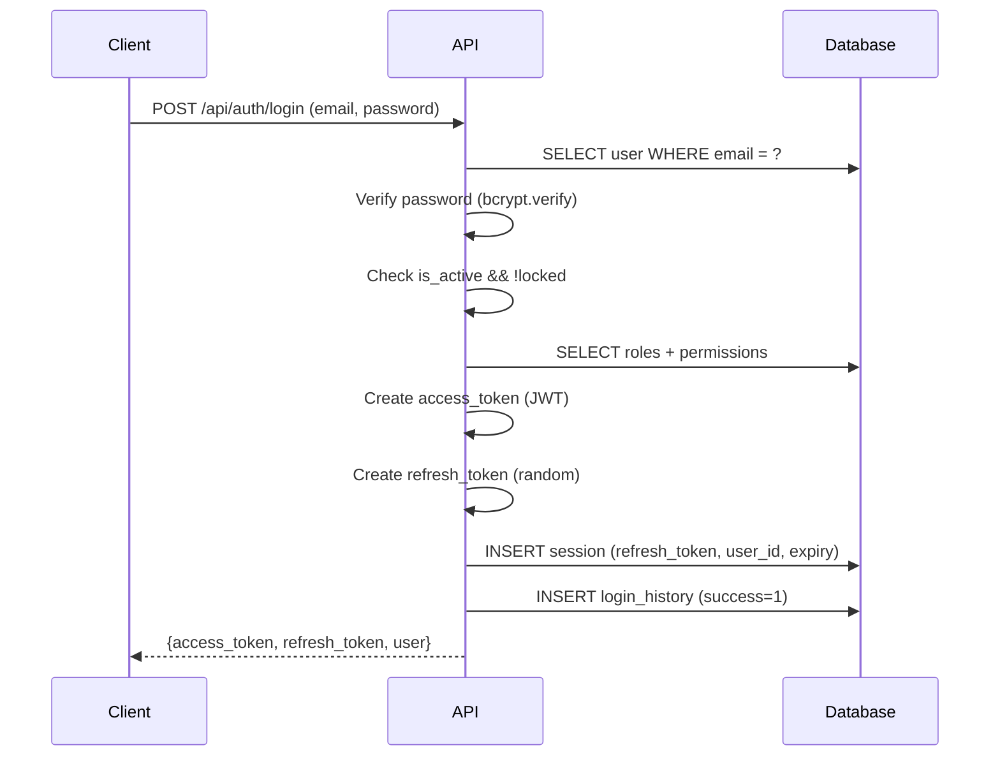

# Authentication

> **Version**: 1.0.0  
> **Last Updated**: 2026-07-30  
> **Status**: Active  
> **Owner**: Backend Lead

---

## Purpose

JWT authentication flow, token lifecycle, and password security.

## Scope

Login, signup, token refresh, password reset, session management.

## Audience

Backend developers and security architects.

---

## 1. JWT Token Model

| Token Type | Lifetime | Storage | Purpose |
|------------|----------|---------|---------|
| Access token | 30 minutes | localStorage (frontend) | API authentication |
| Refresh token | 7 days | Database (sessions table) | Renew access tokens |

### JWT Claims

```json
{
  "sub": "user_id",
  "email": "user@example.com",
  "org_id": 123,
  "roles": ["org_admin"],
  "permissions": ["users.read", "users.create", ...],
  "exp": 1234567890,
  "iat": 1234567890,
  "type": "access"
}
```

## 2. Authentication Flow



## 3. Password Security

- **Hashing**: bcrypt with salt
- **Password history**: Last 5 passwords stored, reuse prevented
- **Account lockout**: After `MAX_FAILED_ATTEMPTS` (default 5), account locked for `LOCKOUT_DURATION`
- **Password reset**: Token-based, expires after configured time
- **Email verification**: Token-based, stored in `email_verified_at`

## 4. Session Management

- Sessions stored in `sessions` table with `refresh_token`, `expires_at`, `ip_address`, `user_agent`
- `SessionRepository` manages CRUD operations
- `revoke_all_for_user()` revokes all sessions (used on password change, user delete)
- Sessions auto-expire based on `expires_at`

## 5. Key Files

| File | Purpose |
|------|---------|
| `shared/security.py` | JWT creation, verification, password hashing |
| `shared/dependencies.py` | `get_current_user()` — JWT decode + user loading |
| `authentication/services.py` | `AuthService` — login, signup, password reset |
| `authentication/routes.py` | Auth API routes |
| `authentication/repositories.py` | `SessionRepository`, `UserRepository` |

## Related Documents

- [authorization.md](authorization.md) — Authorization (RBAC)
- [api-overview.md](api-overview.md) — API overview
- [../governance/security-model.md](../governance/security-model.md) — Security model
- [../architecture/sequence-diagrams.md](../architecture/sequence-diagrams.md) — Auth sequence diagrams
