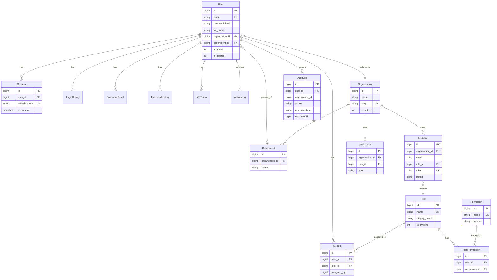
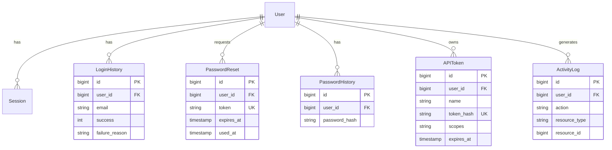

# Entity Relationship Diagram

> **Version**: 1.0.0  
> **Last Updated**: 2026-07-30  
> **Status**: Active  
> **Owner**: Database Architect

---

## Purpose

Visual representation of table relationships in the database.

## Scope

Core authentication, organization, and audit tables.

## Audience

Developers and database administrators.

---

## 1. Core Entity Relationship Diagram

## 2. Authentication Entity Relationships

## Related Documents

- [schema.md](schema.md) — Complete schema
- [indexing.md](indexing.md) — Index strategy
- [../governance/organization-model.md](../governance/organization-model.md) — Org model
