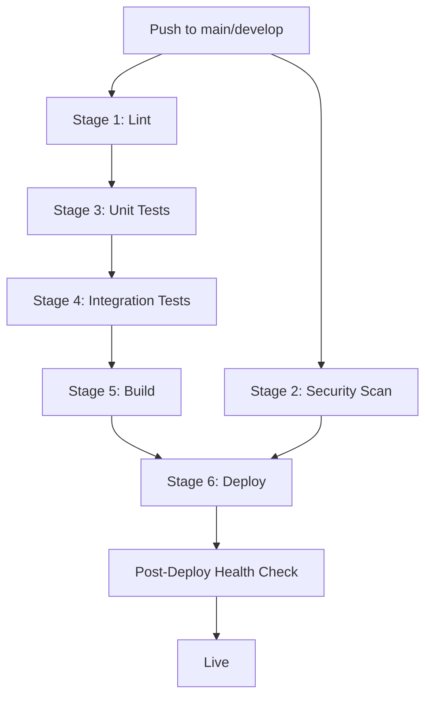

# CI/CD

> **Version**: 2.0.0  
> **Last Updated**: 2026-08-01  
> **Status**: Active  
> **Owner**: DevOps Engineer

---

## Purpose

Document the CI/CD pipeline configuration and architecture.

## Scope

All GitHub Actions workflows, deployment pipeline, dependency management, and build verification.

## Audience

DevOps engineers, developers, and release managers.

---

## 1. Pipeline Architecture

The platform uses a 6-stage CI/CD pipeline with separate workflows for PRs, builds, and dependency checks.



### Pipeline Stages

| Stage | Job | Dependencies | Description |
|-------|-----|-------------|-------------|
| 1. Lint | `lint` | — | Ruff + Black (Python), ESLint + tsc (Frontend) |
| 2. Security Scan | `security-scan` | — (parallel) | pip-audit, Bandit, npm audit, Trivy |
| 3. Unit Tests | `unit-tests` | Lint | pytest + coverage, vitest |
| 4. Integration Tests | `integration-tests` | Unit Tests | MySQL + Redis services, Alembic migrations |
| 5. Build | `build` | Integration Tests | Backend imports, Alembic verify, frontend build, Docker build |
| 6. Deploy | `deploy` | Build + Security | Vercel production deploy + health check (main only) |

## 2. Workflows

### CI Pipeline (`.github/workflows/ci.yml`)

**Triggers**: Push to `main` or `develop`, manual dispatch

**Key features**:
- Python 3.12, Node 20
- pip and npm caching
- Docker build with GHA cache backend
- Codecov coverage upload
- Trivy SARIF upload to GitHub Security tab
- Vercel deployment with post-deploy health check (10 retries)

### PR Checks (`.github/workflows/pr-checks.yml`)

**Triggers**: Pull request to `main` or `develop`

**Key features**:
- Quick lint on changed Python files only (git diff)
- Fast-fail tests (`-x --maxfail=5`)
- PR build check (backend imports + frontend build)
- Auto-generated PR summary in GitHub Step Summary

### Build Verification (`.github/workflows/build-verify.yml`)

**Triggers**: Push affecting Dockerfile, docker-compose, frontend, api, requirements.txt, pyproject.toml

**Key features**:
- All module imports verified
- Alembic migration verification
- Database CLI verification (status, indexes, backup)
- Docker container health check on port 8001
- docker-compose config validation

### Dependency Check (`.github/workflows/dependency-check.yml`)

**Triggers**: Weekly schedule (Monday 9:00 UTC), manual dispatch

**Key features**:
- pip-audit on requirements.txt and pyproject.toml
- npm audit on frontend
- Outdated package reporting
- Auto-creates GitHub issues when vulnerabilities found

### Dependabot (`.github/dependabot.yml`)

**Ecosystems**: pip, npm (frontend), GitHub Actions

**Schedule**: Weekly on Monday at 09:00 UTC, 5 PR limit per ecosystem

## 3. Security Scanning

| Tool | Scope | When | Severity |
|------|-------|------|----------|
| pip-audit | Python dependencies | On push + weekly | All vulnerabilities |
| Bandit | Python source code (SAST) | On push | Medium+ |
| npm audit | Frontend dependencies | On push + weekly | High+ |
| Trivy | Full filesystem | On push | HIGH, CRITICAL |

Trivy SARIF results are uploaded to GitHub Security tab for tracking and PR annotations.

## 4. Required Secrets

| Secret | Description | Required for |
|--------|-------------|--------------|
| `VERCEL_TOKEN` | Vercel deployment token | Deploy stage |
| `VERCEL_ORG_ID` | Vercel organization ID | Deploy stage |
| `VERCEL_PROJECT_ID` | Vercel project ID | Deploy stage |

## 5. Branch Strategy

| Branch | Purpose | Deploy Target | CI Pipeline |
|--------|---------|---------------|-------------|
| `main` | Production | Production Vercel | Full 6-stage pipeline |
| `develop` | Development | Not deployed | Full pipeline (no deploy) |
| Feature branches | Development | Not deployed | PR checks only |

## 6. Caching

| Cache | Key | Backend |
|-------|-----|---------|
| pip | `requirements.txt` hash | `actions/setup-python` |
| npm | `package-lock.json` hash | `actions/setup-node` |
| Docker layers | GHA cache | `docker/build-push-action` |

## 7. Local Testing

Run the same checks locally before pushing:

```bash
# Python lint
ruff check .
black --check .

# Python tests
pytest tests/ --tb=short -v

# Frontend lint + type check
cd frontend && npx next lint
cd frontend && npx tsc --noEmit

# Frontend tests
cd frontend && npx vitest run

# Frontend build
cd frontend && npm run build

# Docker build + health check
docker build -t aedip-local .
docker run -d --name aedip-test -p 8000:8000 \
  -e DB_TYPE=sqlite -e SQLITE_DB_PATH=/tmp/test.db \
  -e JWT_SECRET_KEY=local-test-secret-key-32chars-min \
  -e DISABLE_CONFIG_VALIDATION=1 \
  aedip-local
sleep 10
curl -f http://localhost:8000/health
docker stop aedip-test
```

## Related Documents

- [../../.github/CICD.md](../../.github/CICD.md) — Full CI/CD documentation
- [vercel.md](vercel.md) — Vercel deployment
- [production.md](production.md) — Production deployment
- [../testing/strategy.md](../testing/strategy.md) — Testing strategy
- [../security/vulnerability-management.md](../security/vulnerability-management.md) — Vulnerability management
- [../architecture/adr/README.md](../architecture/adr/README.md) — ADR-0016 (CI/CD Pipeline Architecture)
