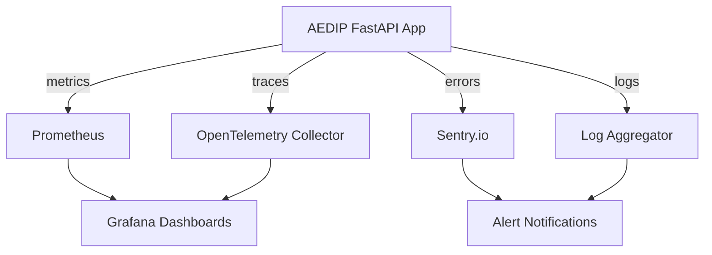

# Production Monitoring

> **Version**: 2.0.0  
> **Last Updated**: 2026-08-01  
> **Status**: Active  
> **Owner**: DevOps Engineer

---

## Purpose

Document the production monitoring stack: error tracking, performance tracing, metrics collection, health checks, and logging.

## Scope

Sentry, OpenTelemetry, Prometheus, Grafana, structured logging, and health check endpoints.

## Audience

DevOps engineers, SREs, developers, and security auditors.

---

## 1. Monitoring Architecture



### Monitoring Layers

| Layer | Tool | Purpose | Activation |
|-------|------|---------|------------|
| Error tracking | Sentry | Exception capture, breadcrumbs, release tracking | `SENTRY_DSN` set |
| Distributed tracing | OpenTelemetry | Request spans, DB traces, Redis traces | `OTEL_EXPORTER_OTLP_ENDPOINT` set |
| Metrics | Prometheus (built-in) | HTTP, DB, pipeline, session, error metrics | Always |
| Dashboards | Grafana | Visualisation and alerting | Monitoring stack deployed |
| Logging | JSON structured | Request logs, audit logs, security logs | `LOG_FORMAT=json` |
| Health checks | Built-in endpoints | Liveness, readiness, detailed health | Always |

## 2. Sentry Error Tracking

### Configuration

| Env Var | Default | Description |
|---------|---------|-------------|
| `SENTRY_DSN` | (empty) | Sentry project DSN. If empty, Sentry is disabled. |
| `SENTRY_TRACES_SAMPLE_RATE` | `0.1` | Performance trace sample rate (0-1) |
| `SENTRY_PROFILES_SAMPLE_RATE` | `0.1` | Profiling sample rate (0-1) |
| `SENTRY_RELEASE` | `aedip@1.0.0` | Release version tag |
| `APP_ENV` | `development` | Environment tag |

### Integrations

- **FastAPI**: Captures request data, transaction names by endpoint
- **SQLAlchemy**: Captures database query exceptions
- **Redis**: Captures Redis operation errors
- **Logging**: Forwards ERROR+ log records as Sentry events
- **Threading**: Propagates Sentry hub to background threads

### Data Scrubbing

The `before_send` filter scrubs `Authorization`, `Cookie`, `X-API-Key` headers and request bodies containing `password`, `token`, `refresh_token`.

## 3. OpenTelemetry Tracing

### Configuration

| Env Var | Default | Description |
|---------|---------|-------------|
| `OTEL_EXPORTER_OTLP_ENDPOINT` | (empty) | OTLP collector endpoint. If empty, OTel is disabled. |
| `OTEL_SERVICE_NAME` | `aedip-api` | Service name in traces |
| `OTEL_SERVICE_VERSION` | `1.0.0` | Service version in traces |
| `OTEL_METRIC_EXPORT_INTERVAL` | `60000` | Metric export interval (ms) |

### Auto-Instrumentation

FastAPI, SQLAlchemy, Redis, and Logging are automatically instrumented.

### Custom Metrics

| Metric | Type | Description |
|--------|------|-------------|
| `aedip_http_requests_total` | Counter | HTTP requests by method, path, status |
| `aedip_http_request_duration_ms` | Histogram | Request duration in milliseconds |
| `aedip_db_queries_total` | Counter | Database queries by operation, table |
| `aedip_db_query_duration_ms` | Histogram | Query duration in milliseconds |
| `aedip_active_sessions` | UpDownCounter | Active user sessions |
| `aedip_pipeline_runs_total` | Counter | Pipeline runs by status |
| `aedip_errors_total` | Counter | Application errors by type, component |

## 4. Prometheus Metrics

### Endpoint

```
GET /metrics
```

Returns metrics in Prometheus text exposition format. No authentication required.

### Available Metrics

| Metric | Type | Labels | Description |
|--------|------|--------|-------------|
| `http_requests_total` | Counter | method, path, status | Total HTTP requests |
| `http_request_duration_ms` | Histogram | method, path | Request duration (ms) |
| `db_queries_total` | Counter | operation, table | Total database queries |
| `db_query_duration_ms` | Histogram | operation, table | Query duration (ms) |
| `pipeline_runs_total` | Counter | status | Total pipeline runs |
| `errors_total` | Counter | error_type, component | Total application errors |
| `active_sessions` | Gauge | — | Active user sessions |
| `db_pool_size` | Gauge | — | Connection pool size |
| `db_pool_checked_out` | Gauge | — | Connections checked out |
| `process_uptime_seconds` | Gauge | — | Process uptime |
| `db_record_count` | Gauge | — | Records in sales table |
| `pipeline_success_rate` | Gauge | — | Pipeline success rate (0-1) |

### Histogram Buckets

```
5, 10, 25, 50, 100, 250, 500, 1000, 2500, 5000, 10000 ms
```

### Path Normalisation

Paths are normalised to reduce cardinality: numeric segments → `:id`, long segments (>20 chars) → `:param`.

## 5. Health Check Endpoints

| Endpoint | Purpose | Status Codes |
|----------|---------|--------------|
| `GET /health` | Lightweight liveness + DB probe | 200 (healthy/degraded) |
| `GET /ready` | Readiness (DB connectivity) | 200 / 503 |
| `GET /health/detailed` | Full subsystem health | 200 |
| `GET /monitoring/health/live` | Liveness probe (process only) | 200 |
| `GET /monitoring/health/ready` | Readiness (DB + Redis + integrations) | 200 / 503 |
| `GET /monitoring/health/detailed` | Detailed health with monitoring status | 200 |
| `GET /monitoring/status` | Monitoring integration status | 200 |

### Kubernetes Probe Mapping

```yaml
livenessProbe:
  httpGet:
    path: /monitoring/health/live
    port: 8000
  initialDelaySeconds: 10
  periodSeconds: 30

readinessProbe:
  httpGet:
    path: /monitoring/health/ready
    port: 8000
  initialDelaySeconds: 5
  periodSeconds: 10
```

## 6. Structured Logging

### Format

Set `LOG_FORMAT=json` to enable JSON structured logging. Each log entry includes:

```json
{
  "timestamp": "2026-08-01T12:00:00,000",
  "level": "INFO",
  "logger": "etl_project",
  "message": "GET /api/v1/sales -> 200 (45ms)",
  "request_id": "a1b2c3d4-...",
  "correlation_id": "e5f6g7h8-..."
}
```

### Log Handlers

- **Console** (stdout): Always enabled (serverless-friendly)
- **File** (rotating): Enabled when `LOG_PATH` is set, 5MB rotation, 5 backups

### Correlation IDs

- `X-Request-ID`: Generated per request (UUID)
- `X-Correlation-ID`: Passed by upstream caller or generated
- Both are set as response headers

## 7. Monitoring Stack Deployment

### Docker Compose

```bash
# Start monitoring stack (Prometheus + Grafana + Node Exporter)
docker compose -f monitoring/docker-compose.monitoring.yml up -d

# Access Grafana at http://localhost:3001 (admin/admin)
# Access Prometheus at http://localhost:9090
```

### Grafana Dashboard

Auto-provisioned from `monitoring/dashboards/grafana-application.json`:

- Request rate by method
- Request duration (p50, p95, p99)
- Error rate (4xx / 5xx)
- Application errors per minute
- Database query duration by table
- Active sessions
- Process uptime
- Pipeline runs by status
- Pipeline success rate
- DB connection pool stats

### Prometheus Scrape Config

Edit `monitoring/prometheus.yml` to add targets:

```yaml
scrape_configs:
  - job_name: "aedip-api"
    metrics_path: "/metrics"
    static_configs:
      - targets: ["api:8000"]
```

## 8. Environment Variables Summary

### Sentry

| Variable | Required | Default |
|----------|----------|---------|
| `SENTRY_DSN` | No | (empty = disabled) |
| `SENTRY_TRACES_SAMPLE_RATE` | No | `0.1` |
| `SENTRY_PROFILES_SAMPLE_RATE` | No | `0.1` |
| `SENTRY_RELEASE` | No | `aedip@1.0.0` |

### OpenTelemetry

| Variable | Required | Default |
|----------|----------|---------|
| `OTEL_EXPORTER_OTLP_ENDPOINT` | No | (empty = disabled) |
| `OTEL_SERVICE_NAME` | No | `aedip-api` |
| `OTEL_SERVICE_VERSION` | No | `1.0.0` |
| `OTEL_METRIC_EXPORT_INTERVAL` | No | `60000` |

### General

| Variable | Required | Default |
|----------|----------|---------|
| `PROMETHEUS_ENABLED` | No | `true` |
| `MONITORING_ENABLED` | No | `true` |
| `LOG_FORMAT` | No | `text` (set `json` for production) |
| `LOG_LEVEL` | No | `INFO` |
| `LOG_PATH` | No | `logs/pipeline.log` |

## Related Documents

- [../security/vulnerability-management.md](../security/vulnerability-management.md) — Vulnerability management
- [../deployment/ci-cd.md](../deployment/ci-cd.md) — CI/CD pipeline
- [../deployment/production.md](../deployment/production.md) — Production deployment
- [../architecture/adr/README.md](../architecture/adr/README.md) — ADR catalog
