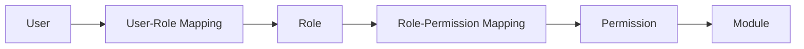
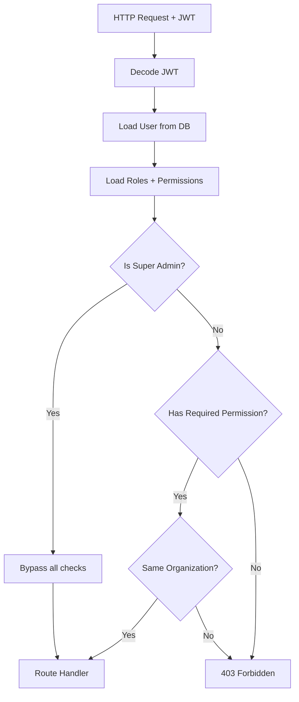

# Authorization

> **Version**: 1.0.0  
> **Last Updated**: 2026-07-30  
> **Status**: Active  
> **Owner**: Security Architect

---

## Purpose

Document the authorization model and enforcement layers.

## Scope

RBAC enforcement, permission checking, and organization access control.

## Audience

Developers, security architects, and backend leads.

---

## 1. Authorization Model

DataFlow uses **Role-Based Access Control (RBAC)** with centralized permission definitions.



## 2. Enforcement Layers

### Layer 1: Authentication (JWT)

Every request (except public endpoints) requires a valid JWT bearer token. The token contains:
- User ID, email, organization ID
- Roles (list of role names)
- Permissions (list of permission strings)

**Implementation**: `shared/dependencies.py:get_current_user()`

### Layer 2: Permission Check (RBAC)

Route handlers declare required permissions via FastAPI dependency injection:

```python
@router.get("/users", dependencies=[Depends(require_permissions("users.read"))])
```

Super admins bypass all permission checks.

**Implementation**: `shared/dependencies.py:require_permissions()`

### Layer 3: Organization Access (Tenant Isolation)

Org-scoped routes enforce that the user belongs to the target organization:

```python
require_organization_access(current_user, org_id, db)
```

Super admins can access any organization. All other users are restricted to their own org.

**Implementation**: `shared/tenant.py:require_organization_access()`

### Layer 4: Tenant Isolation Middleware

Defense-in-depth middleware that logs cross-tenant access attempts (403 responses):

**Implementation**: `saas/tenant_middleware.py:TenantIsolationMiddleware`

### Layer 5: Frontend (UX Only)

Frontend hides UI elements based on permissions — not a security control:

**Implementation**: `RouteGuard`, `Can` components, `Sidebar` visibility

## 3. Permission Checking Flow



## 4. Key Functions

| Function | File | Purpose |
|----------|------|---------|
| `get_current_user()` | `shared/dependencies.py` | JWT verification + user loading |
| `require_permissions(*perms)` | `shared/dependencies.py` | Permission check dependency factory |
| `require_any_role(*roles)` | `shared/dependencies.py` | Role check dependency factory |
| `is_super_admin(user)` | `shared/tenant.py` | Check for super_admin role |
| `get_current_organization_id(user, db)` | `shared/tenant.py` | Get user's org ID |
| `require_organization_access(user, org_id, db)` | `shared/tenant.py` | Enforce org-scoped access |
| `apply_organization_filter(query, org_id)` | `shared/tenant.py` | Add org_id filter to SQLAlchemy query |

## Related Documents

- [roles.md](roles.md) — Role definitions
- [permission-matrix.md](permission-matrix.md) — Complete permission matrix
- [api-authorization-matrix.md](api-authorization-matrix.md) — API endpoint authorization
- [security-model.md](security-model.md) — Security architecture
- [../architecture/adr/README.md](../architecture/adr/README.md) — ADR-0005, ADR-0008
