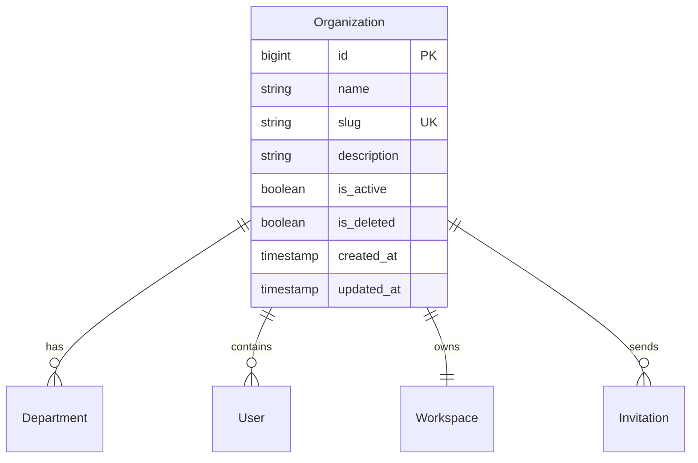
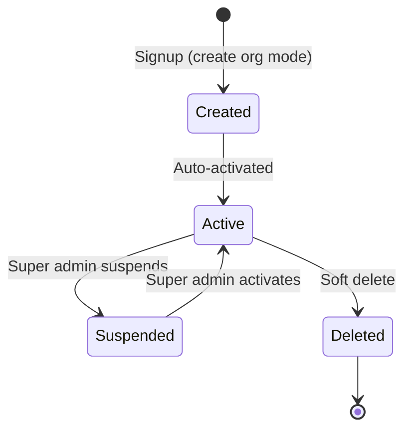
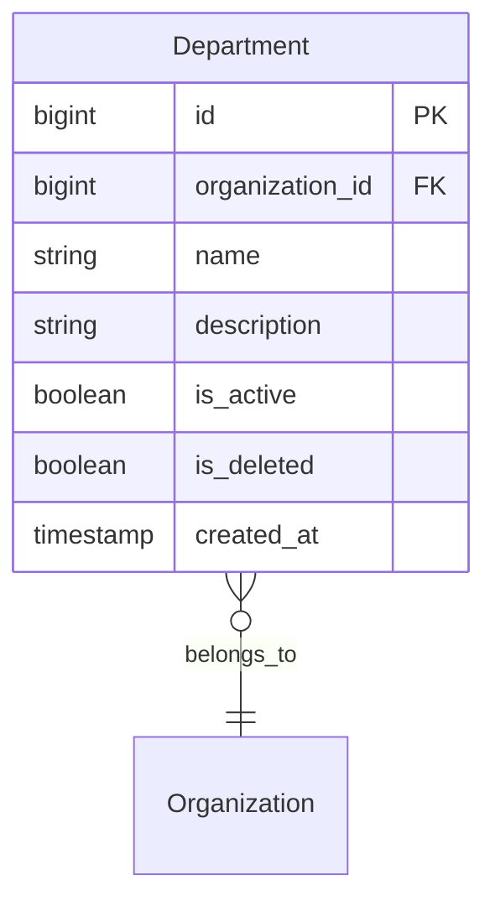

# Organization Model

> **Version**: 1.0.0  
> **Last Updated**: 2026-07-30  
> **Status**: Active  
> **Owner**: Enterprise Architect

---

## Purpose

Document the organization, department, and tenant model.

## Scope

Organization lifecycle, department structure, and tenant isolation.

## Audience

Developers, architects, and organization administrators.

---

## 1. Organization Model

## 2. Organization Lifecycle

## 3. Organization Creation

- **Who**: Any user via `/signup` or `/signup-v2` (create_organization mode)
- **Role**: Creator becomes `org_admin`
- **Workspace**: Organization workspace auto-created
- **Slug**: Generated from org name (lowercase, spaces → hyphens)
- **Duplicate check**: Slug uniqueness enforced
- **Audit**: `organization.created` logged

## 4. Department Model

- Departments are subdivisions of organizations
- Users have an optional `department_id`
- `dept_manager` role manages department operations
- Department-level data scoping is planned (not yet enforced in queries)

## 5. Tenant Isolation

All data tables include `organization_id` for tenant scoping:
- Non-super-admin queries filtered by `organization_id`
- `require_organization_access()` enforces org-scoped route access
- `TenantFilter.apply_org_filter()` adds org_id to SQLAlchemy queries
- `TenantIsolationMiddleware` logs cross-tenant access attempts

## Related Documents

- [workspace-model.md](workspace-model.md) — Workspace types
- [authorization.md](authorization.md) — Authorization enforcement
- [security-model.md](security-model.md) — Security architecture
- [../architecture/adr/README.md](../architecture/adr/README.md) — ADR-0001, ADR-0007
