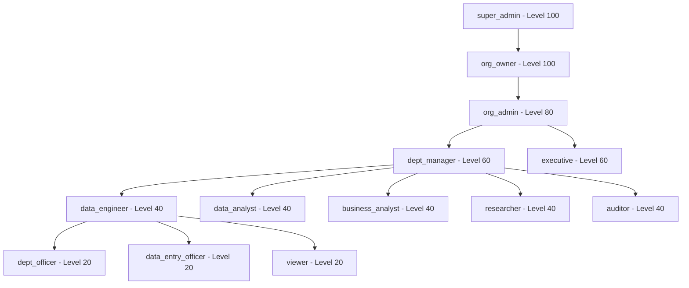

# Roles

> **Version**: 1.0.0  
> **Last Updated**: 2026-07-30  
> **Status**: Active  
> **Owner**: IAM Architect

---

## Purpose

Document all platform roles with descriptions, hierarchy, and assignment rules.

## Scope

All system and custom roles in the RBAC model.

## Audience

Developers, security architects, and organization administrators.

---

## 1. Role Hierarchy

## 2. System Roles

### Platform-Level Roles

| Role | System Name | Level | Description | Invitable | Assignable by Non-Super-Admin |
|------|-------------|-------|-------------|-----------|-------------------------------|
| Super Administrator | `super_admin` | 100 | Full system access, all permissions | No | No |
| Organization Owner | `org_owner` | 100 | Full org access, all except `settings.manage` | No | No |

### Organization-Level Roles

| Role | System Name | Level | Description | Invitable |
|------|-------------|-------|-------------|-----------|
| Organization Administrator | `org_admin` | 80 | Manage users, data, settings within org | Yes |
| Department Manager | `dept_manager` | 60 | Manage department operations | Yes |
| Executive | `executive` | 60 | View high-level analytics and reports | Yes |
| Data Engineer | `data_engineer` | 40 | Build and run ETL pipelines | Yes |
| Data Analyst | `data_analyst` | 40 | Analyze data, create reports and dashboards | Yes |
| Business Analyst | `business_analyst` | 40 | View dashboards and reports | Yes |
| Researcher | `researcher` | 40 | Upload research datasets, statistical analysis | Yes |
| Auditor | `auditor` | 40 | View audit logs and security events | Yes |
| Department Officer | `dept_officer` | 20 | Department-level read-only operations | Yes |
| Data Entry Officer | `data_entry_officer` | 20 | Upload documents, use Smart Data Capture | Yes |
| Viewer | `viewer` | 20 | Read-only access to dashboards | Yes |

## 3. Role Assignment Rules

1. `super_admin` and `org_owner` **cannot** be assigned via invitation
2. Non-super-admin users **cannot** assign `super_admin` or `org_owner` roles
3. System roles (`is_system = 1`) **cannot** be deleted
4. Custom roles can be created with any subset of permissions (requires `roles.manage`)
5. Users can have multiple roles — permissions are the union of all role permissions
6. Role assignment is audit-logged

## 4. Default Role Assignment

| Registration Mode | Role Assigned | Rationale |
|-------------------|---------------|-----------|
| Create Organization | `org_admin` | Creator needs full org management |
| Join via Invitation | Role from invitation | Admin chooses role at invite time |
| Personal Workspace | `viewer` | Personal users have limited access |

## 5. Custom Roles

Custom roles can be created via the RoleService API:
- Requires `roles.manage` permission
- Can include any subset of system permissions
- Are org-scoped (visible within the creating org)
- Can be updated and soft-deleted

## Related Documents

- [permission-matrix.md](permission-matrix.md) — Complete permission matrix
- [authorization.md](authorization.md) — Authorization enforcement
- [../architecture/adr/README.md](../architecture/adr/README.md) — ADR-0005 (RBAC)
