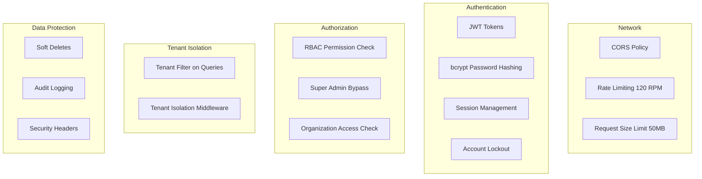

# Security Model

> **Version**: 1.0.0  
> **Last Updated**: 2026-07-30  
> **Status**: Active  
> **Owner**: Security Architect

---

## Purpose

Document the overall security architecture.

## Scope

Authentication, authorization, tenant isolation, data protection, and security headers.

## Audience

Security architects, auditors, and compliance officers.

---

## 1. Security Layers

## 2. Authentication Security

| Feature | Implementation | Status |
|---------|---------------|--------|
| Password hashing | bcrypt | ✅ Active |
| JWT tokens | Access + refresh tokens | ✅ Active |
| Token storage | localStorage (frontend) | ⚠️ XSS risk |
| Account lockout | After failed attempts | ✅ Active |
| Session revocation | Database-backed sessions | ✅ Active |
| Password reset | Token-based email reset | ✅ Active |
| Email verification | Token-based | ✅ Active |

## 3. Authorization Security

| Feature | Implementation | Status |
|---------|---------------|--------|
| RBAC | 13 system roles, 30+ permissions | ✅ Active |
| Permission middleware | `require_permissions()` on all routes | ✅ Active |
| Super admin bypass | Intentional, audit-logged | ✅ Active |
| Org access enforcement | `require_organization_access()` | ✅ Active |
| Platform role protection | Cannot be invited or assigned by non-super-admin | ✅ Active |

## 4. Tenant Isolation

| Feature | Implementation | Status |
|---------|---------------|--------|
| Org-scoped queries | `TenantFilter.apply_org_filter()` | ✅ Active |
| Org access on routes | `require_organization_access()` | ✅ Active |
| User listing scoping | Org-scoped for non-super-admin | ✅ Active |
| Tenant middleware | Logs cross-tenant 403s | ✅ Active (logging only) |

## 5. Security Headers

Added by `SecurityHeadersMiddleware`:
- Content-Security-Policy
- X-Content-Type-Options: nosniff
- X-Frame-Options: DENY
- Strict-Transport-Security (HSTS)
- X-XSS-Protection

## 6. Known Risks

| Risk | Severity | Mitigation | Status |
|------|----------|------------|--------|
| localStorage token storage | High | Move to httpOnly cookies | ⚠️ Planned |
| No MFA | Medium | Implement TOTP | ⚠️ Planned (ADR-0012) |
| No SSO | Medium | Implement SAML/OIDC | ⚠️ Planned (ADR-0012) |
| Passive tenant middleware | Medium | Actively block cross-tenant | ⚠️ Accepted |
| No rate limiting on auth endpoints | Low | Add per-endpoint limits | ⚠️ Planned |

## Related Documents

- [authorization.md](authorization.md) — Authorization model
- [audit-logging.md](audit-logging.md) — Audit logging
- [compliance-notes.md](compliance-notes.md) — Compliance readiness
- [../architecture/adr/README.md](../architecture/adr/README.md) — Security ADRs
