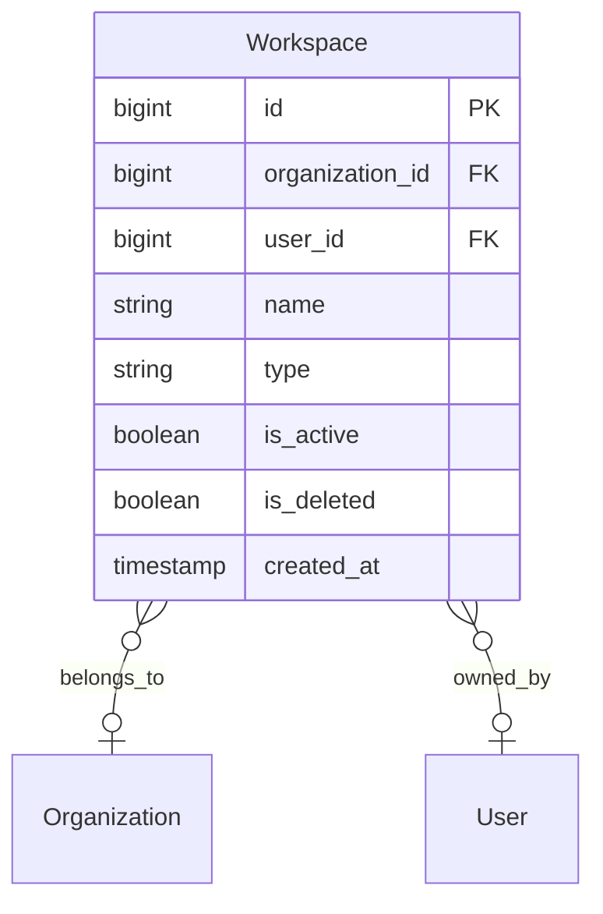

# Workspace Model

> **Version**: 1.0.0  
> **Last Updated**: 2026-07-30  
> **Status**: Active  
> **Owner**: Enterprise Architect

---

## Purpose

Document workspace types, lifecycle, and relationship to organizations.

## Scope

Organization workspaces and personal workspaces.

## Audience

Developers, architects, and product managers.

---

## 1. Workspace Types

| Type | `organization_id` | `user_id` | Description |
|------|-------------------|-----------|-------------|
| Organization | Set | Null | Shared workspace for all org members |
| Personal | Null | Set | Private workspace for a single user |

## 2. Workspace Model

## 3. Auto-Creation

Workspaces are auto-created during registration:

| Registration Mode | Workspace Type | Name |
|-------------------|---------------|------|
| Create Organization | Organization | `"{OrgName} Workspace"` |
| Join via Invitation | Organization | (uses existing org workspace) |
| Personal | Personal | `"{FullName}'s Workspace"` |

## 4. Current Status

- Workspaces are created but **not yet used for query scoping**
- All data queries are scoped by `organization_id` on the resource, not by workspace
- The workspace model exists as a foundation for future workspace-level features

## 5. Upgrade Path

Personal workspace users can upgrade by:
1. **Creating an organization** — Gets org_admin role, org workspace created
2. **Accepting an invitation** — Joins existing org, gets role from invitation

## Related Documents

- [organization-model.md](organization-model.md) — Organization model
- [../architecture/adr/README.md](../architecture/adr/README.md) — ADR-0009 (Workspace Model)
- [../workflows/onboarding.md](../workflows/onboarding.md) — Onboarding workflow
