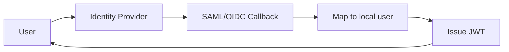

# Authentication Providers

> **Version**: 1.0.0  
> **Last Updated**: 2026-07-30  
> **Status**: Planned  
> **Owner**: Security Architect

---

## Purpose

Document planned authentication provider integrations (SSO).

## Scope

SAML 2.0, OIDC, and social login providers.

## Audience

Security architects and developers.

---

> **⚠️ Planned**: SSO integration is not yet implemented. See [ADR-0012](../architecture/adr/README.md).

## 1. Planned Providers

| Provider | Protocol | Status | Use Case |
|----------|----------|--------|----------|
| Okta | SAML 2.0 | ⚠️ Planned | Enterprise SSO |
| Azure AD | SAML 2.0 | ⚠️ Planned | Microsoft enterprise |
| Google Workspace | OIDC | ⚠️ Planned | Google enterprise |
| Auth0 | OIDC | ⚠️ Planned | Auth platform |
| Generic SAML | SAML 2.0 | ⚠️ Planned | Any SAML IdP |
| Generic OIDC | OIDC | ⚠️ Planned | Any OIDC IdP |

## 2. Planned Architecture

## 3. Planned Features

- Organization-level IdP configuration
- Auto-provisioning on first SSO login
- Group-to-role mapping
- SCIM 2.0 for automated user lifecycle
- MFA enforcement for SSO users

## Related Documents

- [../backend/authentication.md](../backend/authentication.md) — Current auth
- [../governance/security-model.md](../governance/security-model.md) — Security model
- [future-integrations.md](future-integrations.md) — Future integrations
