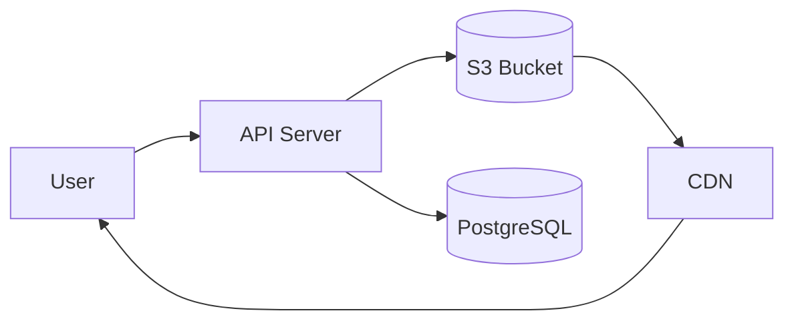

# Cloud Storage

> **Version**: 1.0.0  
> **Last Updated**: 2026-07-30  
> **Status**: Planned  
> **Owner**: DevOps Engineer

---

## Purpose

Document planned cloud storage integration.

## Scope

S3, Google Cloud Storage, and Azure Blob Storage integration.

## Audience

DevOps engineers and data engineers.

---

> **⚠️ Planned**: Cloud storage integration is not yet implemented. Dataset files are currently stored in the database.

## 1. Vision

Offload dataset file storage to cloud storage (S3, GCS, Azure Blob) to:
- Reduce database size
- Enable large file support
- Support CDN delivery
- Enable versioned file storage

## 2. Planned Providers

| Provider | Status | Use Case |
|----------|--------|----------|
| Amazon S3 | ⚠️ Planned | Primary cloud storage |
| Google Cloud Storage | ⚠️ Planned | Alternative |
| Azure Blob Storage | ⚠️ Planned | Enterprise customers |

## 3. Planned Architecture

## 4. Planned Features

- Pre-signed upload URLs (direct browser-to-S3 upload)
- Automatic file cleanup on dataset deletion
- File versioning
- Org-scoped storage buckets or prefixes

## Related Documents

- [file-imports.md](file-imports.md) — Current file import
- [future-integrations.md](future-integrations.md) — Future integrations
- [../architecture/integrations.md](../architecture/integrations.md) — Architecture integrations
