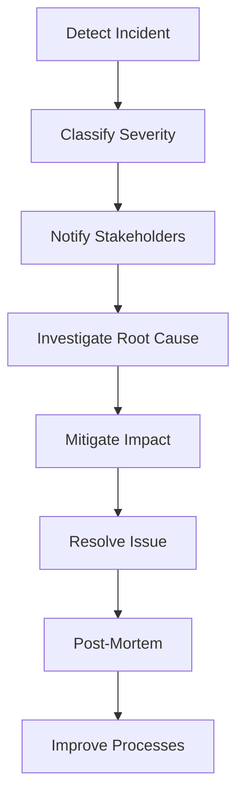

# Incident Response

> **Version**: 1.0.0  
> **Last Updated**: 2026-07-30  
> **Status**: Active  
> **Owner**: DevOps Engineer

---

## Purpose

Incident response procedure for security and operational incidents.

## Scope

All incidents: security breaches, outages, data loss, performance degradation.

## Audience

DevOps engineers, security team, and CTO.

---

## 1. Incident Severity Levels

| Level | Description | Response Time | Examples |
|-------|-------------|---------------|----------|
| SEV-1 | Critical | Immediate | Data breach, total outage |
| SEV-2 | High | < 1 hour | Partial outage, security vulnerability |
| SEV-3 | Medium | < 4 hours | Performance degradation, non-critical bug |
| SEV-4 | Low | < 24 hours | Minor bug, cosmetic issue |

## 2. Incident Response Process



## 3. Response Team

| Role | Responsibility |
|------|---------------|
| On-call engineer | First response, initial investigation |
| DevOps lead | Infrastructure issues |
| Security architect | Security incidents |
| Backend lead | Application bugs |
| CTO | SEV-1 escalation |

## 4. Incident Checklist

### SEV-1 (Critical)

1. [ ] Acknowledge incident
2. [ ] Notify CTO and response team
3. [ ] Assess scope (which users/orgs affected)
4. [ ] Mitigate (rollback, disable feature, block traffic)
5. [ ] Investigate root cause
6. [ ] Apply fix
7. [ ] Verify resolution
8. [ ] Write post-mortem within 48 hours
9. [ ] Implement preventive measures

### Data Breach

1. [ ] Identify breached data (what, how much, which orgs)
2. [ ] Block attack vector
3. [ ] Preserve evidence (logs, audit trails)
4. [ ] Notify affected organizations
5. [ ] Notify legal/compliance team
6. [ ] File required regulatory notifications (GDPR 72h, etc.)
7. [ ] Post-mortem and prevention plan

## 5. Communication Templates

### Initial Notification

```
[SEV-X] Incident detected: <description>
Impact: <affected users/features>
Status: Investigating
Owner: <on-call engineer>
Next update: <time>
```

### Resolution

```
[SEV-X] Resolved: <description>
Root cause: <cause>
Resolution: <action taken>
Duration: <time to resolve>
Post-mortem: <link>
```

## Related Documents

- [../governance/security-model.md](../governance/security-model.md) — Security model
- [../governance/audit-logging.md](../governance/audit-logging.md) — Audit logs
- [disaster-recovery.md](disaster-recovery.md) — Disaster recovery
- [troubleshooting.md](troubleshooting.md) — Troubleshooting
