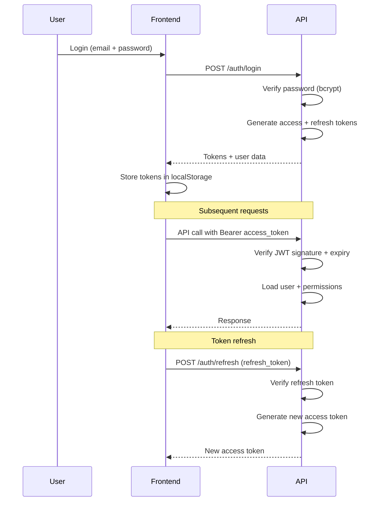

# Authentication Security

> **Version**: 1.0.0  
> **Last Updated**: 2026-08-01  
> **Status**: Active  
> **Owner**: Security Architect

---

## Purpose

Document all authentication mechanisms, token lifecycle, and identity verification flows.

## Scope

Password management, JWT tokens, MFA, session management, account lockout, email verification, and password reset.

## Audience

Security architects, backend developers, and auditors.

---

## 1. Password Security

### Hashing

| Parameter | Value |
|-----------|-------|
| Algorithm | bcrypt (primary), Argon2 (fallback) |
| Library | `passlib` with `argon2-cffi` |
| bcrypt rounds | 12 (default) |
| Salt | Auto-generated per hash |

Passwords are never stored in plaintext. The `passlib` `CryptContext` is configured with both bcrypt and Argon2 schemes for forward compatibility.

### Password Requirements

- Minimum 8 characters
- Must contain at least one uppercase, lowercase, digit, and special character
- Validated on registration and password change
- Cannot match email or full name

### Password Reset

1. User requests reset via email
2. System generates a time-limited token (1-hour expiry)
3. Token sent via email (never returned in API response)
4. User submits new password with token
5. Token is invalidated after use

## 2. JWT Token System

### Token Types

| Token | Purpose | Expiry | Storage |
|-------|---------|--------|---------|
| Access token | API authentication | 30 minutes | Frontend localStorage |
| Refresh token | Renew access token | 7 days | Frontend localStorage |

### Token Format

- **Algorithm**: HS256
- **Signing key**: `JWT_SECRET_KEY` env var (minimum 32 characters)
- **Claims**: `sub` (user ID), `email`, `org_id`, `roles`, `exp`, `iat`, `type`

### Token Lifecycle

### Token Revocation

- Sessions are database-backed — revocation is immediate
- Password change invalidates all existing tokens
- Account lockout prevents new token issuance
- Super admin can revoke any user's sessions

## 3. Multi-Factor Authentication (MFA)

| Feature | Implementation |
|---------|---------------|
| Type | TOTP (RFC 6238) |
| Library | `pyotp` |
| Setup | QR code presented to user |
| Backup codes | 10 single-use codes |
| Enforcement | Optional per-user (not org-level yet) |

### MFA Enrollment Flow

1. User navigates to security settings
2. User enables MFA
3. System generates TOTP secret
4. QR code displayed (scannable by Authy, Google Authenticator, etc.)
5. User enters 6-digit code to verify
6. Backup codes generated and shown once
7. MFA is now active for this user

### MFA Login Flow

1. User submits email + password
2. API verifies password
3. If MFA enabled: API returns `mfa_required` response
4. User submits 6-digit TOTP code
5. API verifies code against stored secret
6. On success: tokens issued

## 4. Account Lockout

| Parameter | Value |
|-----------|-------|
| Max failed attempts | 5 |
| Lockout duration | 15 minutes |
| Tracking | `failed_login_count` + `locked_until` in users table |
| Reset | Counter resets on successful login |

After 5 consecutive failed login attempts, the account is locked for 15 minutes. The lockout is automatically lifted after the timeout period.

## 5. Email Verification

- New users receive a verification email with a time-limited token
- Email must be verified before first login (configurable)
- Token has 24-hour expiry
- Resend verification endpoint available

## 6. Session Management

| Feature | Implementation |
|---------|---------------|
| Session storage | Database-backed (`sessions` table) |
| Session tracking | IP address, user agent, created_at |
| Active sessions | Viewable by user, revocable |
| Concurrent sessions | Allowed (no limit currently) |
| Session cleanup | Expired sessions purged periodically |

## 7. Known Risks and Mitigations

| Risk | Severity | Mitigation | Status |
|------|----------|------------|--------|
| localStorage token storage | Medium | Move to httpOnly cookies | Planned |
| No org-level MFA enforcement | Low | Add org policy setting | Planned |
| No concurrent session limit | Low | Add configurable limit | Planned |
| Refresh token rotation | Medium | Implement rotating refresh tokens | Planned |

## Related Documents

- [overview.md](overview.md) — Security architecture overview
- [authorization.md](authorization.md) — Authorization model
- [../governance/security-model.md](../governance/security-model.md) — Security model summary
- [../backend/authentication.md](../backend/authentication.md) — Backend auth implementation
