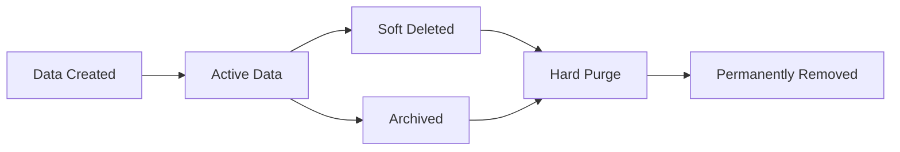

# Data Protection

> **Version**: 1.0.0  
> **Last Updated**: 2026-08-01  
> **Status**: Active  
> **Owner**: Security Architect

---

## Purpose

Document data protection mechanisms including encryption, retention, PII handling, and soft deletes.

## Scope

Encryption at rest, data retention policies, PII handling, soft deletes, and data lifecycle.

## Audience

Security architects, backend developers, compliance officers, and auditors.

---

## 1. Encryption at Rest

### Implementation

| Component | Technology | Details |
|-----------|-----------|---------|
| Sensitive fields | AES-256 via `cryptography` library | Field-level encryption |
| Encryption key | `ENCRYPTION_KEY` env var | 32-byte key, base64-encoded |
| Key rotation | Manual (replace key + re-encrypt) | Documented procedure |
| Production requirement | Key must be set explicitly | Validated on startup |

### Encrypted Fields

| Table | Field | Encryption |
|-------|-------|------------|
| users | email | AES-256 (searchable hash for lookup) |
| users | phone | AES-256 |
| organizations | billing_email | AES-256 |
| invitations | email | AES-256 |

### How Field Encryption Works

1. On write: plaintext → AES-256 encrypt → store ciphertext
2. On read: ciphertext → AES-256 decrypt → return plaintext
3. For searchable fields: additional SHA-256 hash stored for equality lookups
4. Key is loaded from `ENCRYPTION_KEY` at startup

### Database-Level Encryption

| Database | Encryption |
|----------|-----------|
| MySQL (production) | InnoDB tablespace encryption, TLS connections |
| SQLite (development) | Filesystem permissions only |

## 2. Data Retention

| Data Type | Retention Period | Configurable Via |
|-----------|-----------------|-------------------|
| Captured documents | 365 days | `CAPTURE_RETENTION_DAYS` |
| Audit logs | 7 years (compliance) | Hardcoded |
| Security logs | 7 years (compliance) | Hardcoded |
| Soft-deleted records | Indefinite (until purged) | Manual purge |
| Backups | 30 days (default) | `BACKUP_RETENTION_DAYS` |
| Session data | Until token expiry | Automatic cleanup |

### Retention Enforcement

- Document retention: Cleanup job runs daily, purges expired documents
- Backup retention: `BackupManager` purges backups older than retention period
- Audit/security logs: No automatic purge (compliance requirement)

## 3. PII Handling

### PII Fields

| Field | Table | Protection |
|-------|-------|------------|
| email | users, invitations, organizations | Encrypted at rest, searchable hash |
| phone | users | Encrypted at rest |
| full_name | users | Not encrypted (business data) |
| password | users | bcrypt hash (never plaintext) |
| IP address | activity_logs, security_logs | Stored in plaintext (audit requirement) |

### PII Access Controls

- Users can only view their own PII
- Org admins can view PII of users in their organization
- Super admins can view all PII (audit-logged)
- PII is never included in API response logs
- PII is never included in error messages

### GDPR Rights

| Right | Implementation |
|-------|---------------|
| Access | User can view their data via `/auth/me` |
| Rectification | User can update profile via `/auth/me` |
| Erasure | Soft delete → manual purge process |
| Portability | User can export their data |
| Objection | User can deactivate account |

## 4. Soft Deletes

### Implementation

All major tables include soft delete columns:

| Column | Type | Purpose |
|--------|------|---------|
| `is_deleted` | Boolean | Marks record as deleted |
| `deleted_at` | Timestamp | When the record was deleted |

### Behavior

- Soft-deleted records are excluded from default queries
- Soft-deleted records can be restored by super_admin
- Hard deletion is only available via manual database operations
- Soft delete is audit-logged

### Tables with Soft Deletes

- users
- organizations
- departments
- datasets
- dashboards
- reports
- invitations
- workspaces

## 5. Data Lifecycle

### Lifecycle Stages

1. **Created**: Data is written with encryption for sensitive fields
2. **Active**: Data is queryable and accessible per RBAC
3. **Soft Deleted**: Data is hidden from normal queries, retained for recovery
4. **Archived**: Data moved to long-term storage (planned)
5. **Hard Purge**: Data permanently removed from database

## 6. Backup Data Protection

- Backups are compressed with gzip
- Backups stored in configurable `BACKUP_STORAGE_PATH`
- Production backups require absolute path
- Backup retention prevents indefinite storage
- Backup files are not encrypted (rely on filesystem encryption)

## Related Documents

- [overview.md](overview.md) — Security architecture overview
- [compliance.md](compliance.md) — Compliance mapping
- [../database/backup-recovery.md](../database/backup-recovery.md) — Backup procedures
- [../database/optimization.md](../database/optimization.md) — Query optimization
