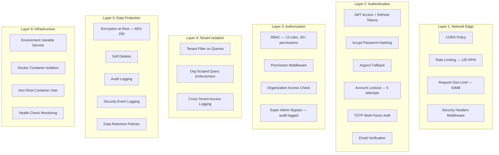

# Security Architecture Overview

> **Version**: 1.0.0  
> **Last Updated**: 2026-08-01  
> **Status**: Active  
> **Owner**: Security Architect

---

## Purpose

Provide a comprehensive overview of the security architecture and defense-in-depth strategy.

## Scope

All security layers from network edge to data storage.

## Audience

Security architects, developers, auditors, and compliance officers.

---

## 1. Defense-in-Depth Strategy

The platform employs multiple layers of security controls. No single layer is relied upon alone — each layer provides additional protection.

## 2. Security Layers Summary

| Layer | Controls | Status |
|-------|----------|--------|
| Network Edge | CORS, rate limiting, request size limits, security headers | ✅ Active |
| Authentication | JWT, bcrypt, account lockout, MFA (TOTP), email verification | ✅ Active |
| Authorization | RBAC (13 roles, 30+ permissions), permission middleware, org access | ✅ Active |
| Tenant Isolation | Org-scoped queries, tenant filter, cross-tenant logging | ✅ Active |
| Data Protection | Encryption at rest, soft deletes, audit logs, security logs | ✅ Active |
| Infrastructure | Env vars, Docker isolation, non-root user, health checks | ✅ Active |

## 3. Authentication Summary

| Feature | Implementation | Details |
|---------|---------------|---------|
| Password hashing | bcrypt (primary), Argon2 (fallback) | `passlib` library |
| JWT tokens | Access (30min) + Refresh (7d) | HS256 signing |
| MFA | TOTP via `pyotp` | Optional per-user |
| Account lockout | 5 failed attempts → 15min lockout | Configurable |
| Email verification | Token-based | Required before first login |
| Password reset | Token-based via email | 1-hour expiry |
| Session revocation | Database-backed | Immediate invalidation |

See [authentication.md](authentication.md) for full details.

## 4. Authorization Summary

| Feature | Implementation |
|---------|---------------|
| Role hierarchy | 13 system roles (super_admin → viewer) |
| Permission model | 30+ granular permissions |
| Enforcement | `require_permissions()` middleware on all routes |
| Organization scoping | `require_organization_access()` on org-specific routes |
| Platform roles | Cannot be assigned by non-super-admin |
| Audit trail | All authorization decisions logged |

See [authorization.md](authorization.md) for full details.

## 5. Data Protection Summary

| Feature | Implementation |
|---------|---------------|
| Encryption at rest | AES-256 via `cryptography` library |
| Encryption key | `ENCRYPTION_KEY` env var (required in production) |
| Soft deletes | `is_deleted` + `deleted_at` on all major tables |
| Audit logging | `audit_logs` table — all write operations |
| Security logging | `security_logs` table — auth events, access denials |
| Data retention | Configurable per data type (default 365 days for documents) |
| PII handling | Email, phone — encrypted at rest; password — hashed |

See [data-protection.md](data-protection.md) for full details.

## 6. API Security Summary

| Feature | Implementation |
|---------|---------------|
| CORS | Configurable origins via `CORS_ORIGINS` env var |
| Rate limiting | 120 RPM default via `slowapi` |
| Security headers | CSP, X-Content-Type-Options, X-Frame-Options, HSTS |
| Input validation | Pydantic schema validation on all endpoints |
| SQL injection | SQLAlchemy ORM parameterized queries |
| XSS | CSP headers, React auto-escaping |
| CSRF | JWT-based auth (not cookies) — not vulnerable |

See [api-security.md](api-security.md) for full details.

## 7. Vulnerability Management

| Tool | Scope | Frequency |
|------|-------|-----------|
| pip-audit | Python dependencies | Weekly + on push |
| npm audit | Frontend dependencies | Weekly + on push |
| Bandit | Python source code (SAST) | On push |
| Trivy | Full filesystem scan | On push |
| Dependabot | All ecosystems | Weekly PRs |

See [vulnerability-management.md](vulnerability-management.md) for full details.

## 8. Production Hardening

Production environments require additional hardening:

- **Database**: MySQL 8.0 (SQLite blocked in production)
- **Secrets**: `JWT_SECRET_KEY`, `ENCRYPTION_KEY` must be set explicitly
- **Backup**: Must use absolute path, enabled by default
- **Config validation**: Enforced on startup
- **Pool sizing**: Production-tuned connection pooling (10+ connections)

See [checklist.md](checklist.md) for the full production security checklist.

## Related Documents

- [authentication.md](authentication.md) — Authentication details
- [authorization.md](authorization.md) — Authorization details
- [data-protection.md](data-protection.md) — Data protection details
- [api-security.md](api-security.md) — API security details
- [vulnerability-management.md](vulnerability-management.md) — Vulnerability management
- [compliance.md](compliance.md) — Compliance mapping
- [checklist.md](checklist.md) — Production security checklist
- [../governance/security-model.md](../governance/security-model.md) — Security model summary
