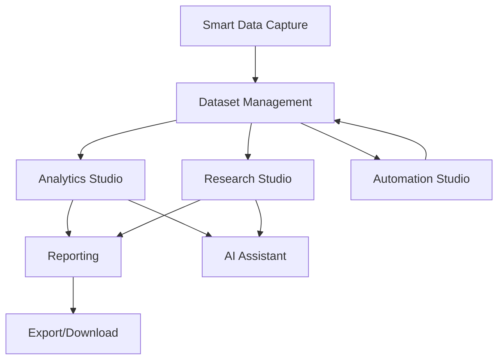

# Studio Integrations

> **Version**: 1.0.0  
> **Last Updated**: 2026-07-30  
> **Status**: Active  
> **Owner**: Solution Architect

---

## Purpose

Document how studios integrate with each other and with platform services.

## Scope

Inter-studio data flow and shared services.

## Audience

Developers and solution architects.

---

## 1. Studio Integration Map

## 2. Shared Services

All studios share these platform services:
- **Authentication & RBAC** — All studios respect permission checks
- **Organization scoping** — All data is org-isolated
- **Audit logging** — All actions are logged
- **Dataset management** — Shared dataset repository
- **AI engine** — Shared AI assistant across studios

## 3. Data Flow Between Studios

| From | To | Data Shared |
|------|-----|----|
| Smart Capture | Datasets | Extracted data becomes a dataset |
| Datasets | Analytics | Datasets power dashboards |
| Datasets | Research | Datasets for statistical analysis |
| Analytics | Reports | Dashboards generate report content |
| Research | Reports | Analysis results in reports |
| Automation | Datasets | ETL pipelines create/update datasets |

## Related Documents

- [../architecture/data-flow.md](../architecture/data-flow.md) — Platform data flow
- [../architecture/integrations.md](../architecture/integrations.md) — External integrations
- [../integrations/](../integrations/) — Integration documentation
