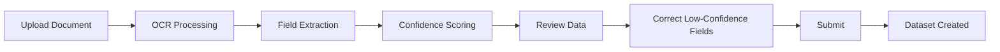

# Smart Data Capture

> **Version**: 1.0.0  
> **Last Updated**: 2026-07-30  
> **Status**: Active  
> **Owner**: Product Manager

---

## Purpose

Document the Smart Data Capture module — OCR and intelligent document processing.

## Scope

Document upload, OCR extraction, confidence scoring, and data correction.

## Audience

Data entry officers, product managers, and developers.

---

## 1. Overview

Smart Data Capture allows users to upload documents (PDF, images) and automatically extract structured data using OCR and intelligent field extraction.

## 2. Workflow

## 3. Key Features

| Feature | Permission | Description |
|---------|------------|-------------|
| Upload documents | `datasets.upload` | Upload PDF or image files |
| OCR extraction | `datasets.upload` | Automatic text and field extraction |
| Confidence scoring | `datasets.upload` | Field-level confidence indicators |
| Data correction | `datasets.upload` | Manual correction of low-confidence fields |
| Track status | `datasets.view` | View processing status |

## 4. Data Entry Officer Role

The `data_entry_officer` role is designed for this module:
- `datasets.upload`, `datasets.view`
- `profile.update`

## 5. Key Routes

| Route | Description |
|-------|-------------|
| `/capture` | Smart Data Capture page |

## 6. Backend

| Endpoint | Permission | Description |
|----------|------------|-------------|
| `POST /api/capture/upload` | `datasets.upload` | Upload document for OCR |
| `GET /api/capture/{id}` | `datasets.view` | Get captured data |
| `PUT /api/capture/{id}` | `datasets.upload` | Update corrected data |

## Related Documents

- [../workflows/document-capture.md](../workflows/document-capture.md) — Document capture workflow
- [../governance/roles.md](../governance/roles.md) — Data Entry Officer role
- [../workflows/user-journeys.md](../workflows/user-journeys.md) — Data Entry Officer journey
