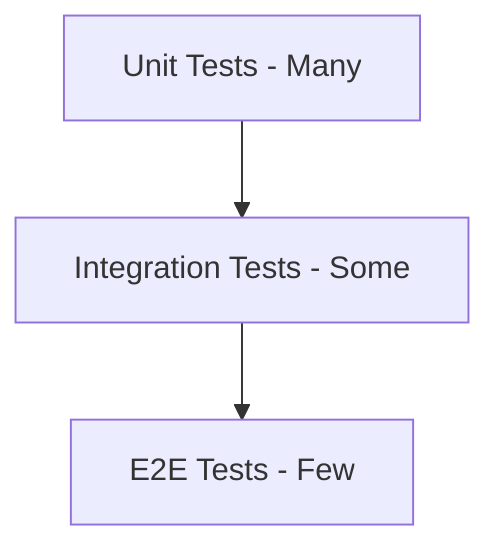

# Testing Strategy

> **Version**: 1.0.0  
> **Last Updated**: 2026-07-30  
> **Status**: Active  
> **Owner**: QA Lead

---

## Purpose

Overall testing strategy and approach.

## Scope

All testing levels: unit, integration, e2e, performance, security, accessibility.

## Audience

All developers and QA engineers.

---

## 1. Testing Pyramid



## 2. Current Testing

| Level | Tool | Status | Coverage |
|-------|------|--------|----------|
| Unit (Backend) | pytest | ✅ Active | Partial |
| Unit (Frontend) | Vitest | ✅ Active | Minimal |
| Integration | pytest | ✅ Active | Partial |
| E2E | — | ⚠️ Planned | None |
| Performance | — | ⚠️ Planned | None |
| Accessibility | — | ⚠️ Planned | None |
| Security | Manual | ⚠️ Partial | Phase 24 audit |

## 3. Testing Priorities

### High Priority
1. Authentication and authorization tests
2. API endpoint tests (all permission checks)
3. Multi-tenant isolation tests
4. Frontend component tests

### Medium Priority
5. E2E tests for critical user flows
6. Performance tests for API endpoints
7. Accessibility tests

### Low Priority
8. Visual regression tests
9. Load tests
10. Chaos engineering

## 4. Test Conventions

### Backend (pytest)

```python
# File: tests/test_auth.py
class TestAuth:
    def test_login_success(self):
        # Arrange, Act, Assert
        pass

    def test_login_invalid_password(self):
        pass
```

### Frontend (Vitest)

```typescript
// File: frontend/__tests__/authStore.test.ts
describe('authStore', () => {
  it('should login successfully', () => {
    // Test
  });
});
```

## Related Documents

- [unit-tests.md](unit-tests.md) — Unit testing
- [integration-tests.md](integration-tests.md) — Integration testing
- [e2e-tests.md](e2e-tests.md) — E2E testing
- [security-tests.md](security-tests.md) — Security testing
