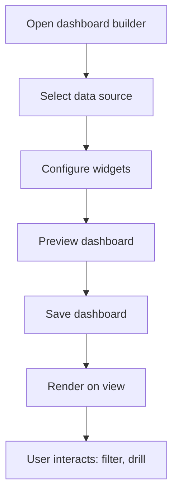

# Dashboard Generation Workflow

> **Version**: 1.0.0  
> **Last Updated**: 2026-07-30  
> **Status**: Active  
> **Owner**: Product Manager

---

## Purpose

Document the dashboard creation and rendering workflow.

## Scope

Dashboard builder, widget configuration, and rendering.

## Audience

Developers and analysts.

---

## 1. Workflow

## 2. Permissions

- View: `dashboard.view`
- Manage: `dashboard.manage`

## 3. Widget Types

| Widget | Description |
|--------|-------------|
| KPI Card | Single metric with trend |
| Bar Chart | Categorical comparison |
| Line Chart | Time series |
| Pie Chart | Distribution |
| Table | Tabular data |
| Gauge | Progress indicator |

## 4. Org Scoping

All dashboards are org-scoped. Data sources are filtered by `organization_id`.

## Related Documents

- [../studios/analytics.md](../studios/analytics.md) — Analytics Studio
- [../architecture/data-flow.md](../architecture/data-flow.md) — Data flow
- [report-generation.md](report-generation.md) — Report generation
