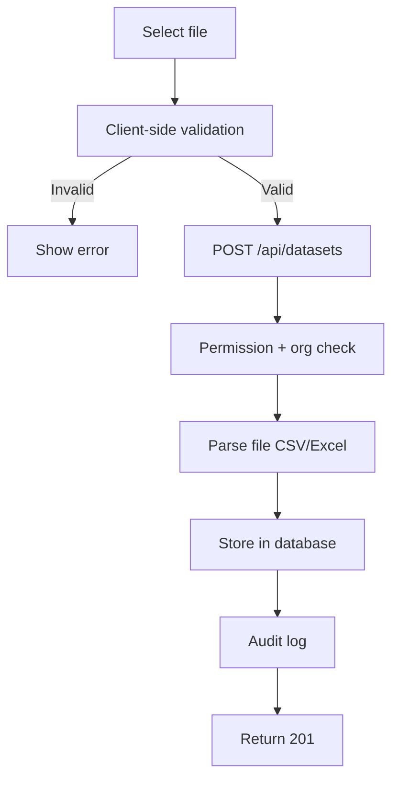

# Dataset Upload Workflow

> **Version**: 1.0.0  
> **Last Updated**: 2026-07-30  
> **Status**: Active  
> **Owner**: Product Manager

---

## Purpose

Document the dataset upload and validation workflow.

## Scope

File selection, upload, parsing, and validation.

## Audience

Developers and data engineers.

---

## 1. Workflow

## 2. Supported Formats

| Format | Extension | Max Size |
|--------|----------|----------|
| CSV | `.csv` | 50MB (configurable) |
| Excel | `.xlsx` | 50MB (configurable) |

## 3. Permissions

- Upload: `datasets.upload`
- View: `datasets.view`
- Delete: `datasets.delete`

## 4. Org Scoping

All datasets are scoped by `organization_id`. Non-super-admin users can only see and upload to their own org.

## Related Documents

- [../studios/analytics.md](../studios/analytics.md) — Analytics Studio
- [../architecture/data-flow.md](../architecture/data-flow.md) — Data flow
- [../backend/endpoints.md](../backend/endpoints.md) — API endpoints
