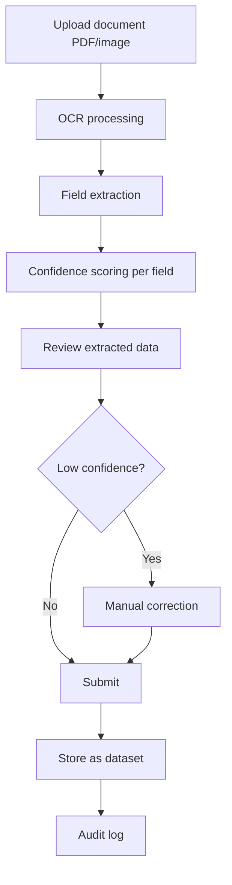

# Document Capture Workflow

> **Version**: 1.0.0  
> **Last Updated**: 2026-07-30  
> **Status**: Active  
> **Owner**: Product Manager

---

## Purpose

Document the document capture and OCR workflow.

## Scope

Document upload, OCR processing, field extraction, and correction.

## Audience

Data entry officers and developers.

---

## 1. Workflow

## 2. Permissions

- Upload: `datasets.upload`
- View: `datasets.view`

## 3. Confidence Scoring

Each extracted field receives a confidence score (0-100):
- **High (80-100)**: Green indicator — likely correct
- **Medium (50-79)**: Yellow indicator — review recommended
- **Low (0-49)**: Red indicator — manual correction required

## 4. Supported Document Types

| Type | Status |
|------|--------|
| PDF | ✅ Active |
| Images (PNG, JPG) | ✅ Active |
| Scanned documents | ✅ Active |

## 5. Backend

| Endpoint | Permission | Description |
|----------|------------|-------------|
| `POST /api/capture/upload` | `datasets.upload` | Upload document |
| `GET /api/capture/{id}` | `datasets.view` | Get extracted data |
| `PUT /api/capture/{id}` | `datasets.upload` | Update corrected data |

## Related Documents

- [../studios/smart-data-capture.md](../studios/smart-data-capture.md) — Smart Data Capture
- [../governance/roles.md](../governance/roles.md) — Data Entry Officer role
- [dataset-upload.md](dataset-upload.md) — Dataset upload
