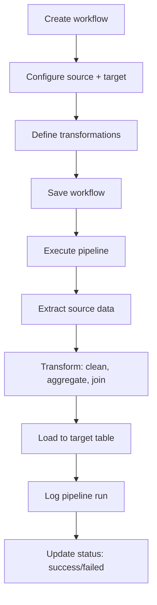

# ETL Pipeline Workflow

> **Version**: 1.0.0  
> **Last Updated**: 2026-07-30  
> **Status**: Active  
> **Owner**: Product Manager

---

## Purpose

Document the ETL pipeline execution workflow.

## Scope

Pipeline creation, execution, and monitoring.

## Audience

Data engineers and developers.

---

## 1. Workflow

## 2. Permissions

- Create: `pipelines.create`
- Execute: `pipelines.execute`
- View: `pipelines.view`
- Import: `etl.import`
- Export: `etl.export`

## 3. Org Scoping

`workflows/service.py` enforces org scoping:
- `_org_id()` gets current user's org
- `_ensure_org_access()` verifies resource belongs to user's org
- `_query_org_scoped()` filters queries by org
- Super admins exempt

## 4. Pipeline Run History

Each execution creates a `pipeline_run` record with:
- Status (running, success, failed)
- Start and end timestamps
- Error messages (if failed)
- Row counts

## Related Documents

- [../studios/automation.md](../studios/automation.md) — Automation Studio
- [../architecture/data-flow.md](../architecture/data-flow.md) — Data flow
- [../backend/services.md](../backend/services.md) — Service layer
