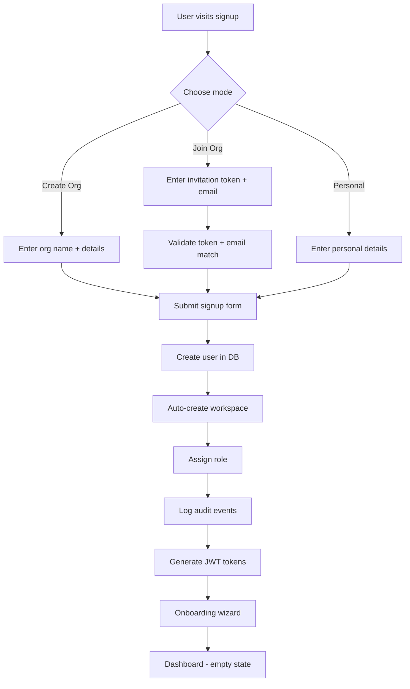

# Onboarding Workflow

> **Version**: 1.0.0  
> **Last Updated**: 2026-07-30  
> **Status**: Active  
> **Owner**: Product Manager

---

## Purpose

Document the user onboarding workflow.

## Scope

Registration through first dashboard view.

## Audience

Product managers, UX designers, and developers.

---

## 1. Registration Modes

| Mode | Entry | Role | Workspace |
|------|-------|------|----------|
| Create Organization | `/signup` (create org) | `org_admin` | Organization workspace |
| Join Organization | `/invite` (invitation) | Role from invitation | Organization workspace |
| Personal | `/signup` (personal) | `viewer` | Personal workspace |

## 2. Onboarding Flow

## 3. Onboarding Wizard

`/onboarding` page collects:
- Industry (for studio recommendation)
- Organization type (for personalization)
- Primary goal (for dashboard customization)

Onboarding data stored in `users.onboarding_data` (JSON column).

## 4. First Dashboard

New users see:
- Welcome message with their name
- Quick Start cards with guided tasks
- Empty states for datasets and dashboards
- KPI cards (empty until data is uploaded)

## Related Documents

- [../governance/organization-model.md](../governance/organization-model.md) — Org model
- [../governance/workspace-model.md](../governance/workspace-model.md) — Workspace model
- [user-journeys.md](user-journeys.md) — Complete user journeys
- [../architecture/sequence-diagrams.md](../architecture/sequence-diagrams.md) — Registration sequences
