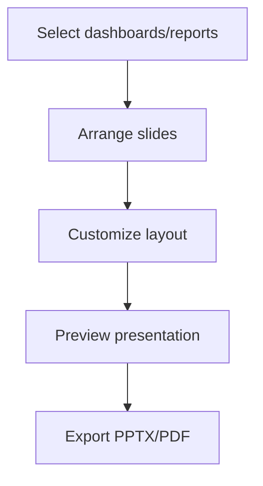

# Presentation Builder

> **Version**: 1.0.0  
> **Last Updated**: 2026-07-30  
> **Status**: Planned  
> **Owner**: Product Manager

---

## Purpose

Document the planned presentation builder feature.

## Scope

Slide creation from dashboards and reports.

## Audience

Product managers and developers.

---

> **⚠️ Planned**: This feature is not yet implemented. This document describes the intended design.

## 1. Vision

The Presentation Builder will allow users to create slide decks from their dashboards, reports, and analytics. Slides can be exported as PowerPoint or PDF.

## 2. Planned Features

| Feature | Description |
|---------|-------------|
| Slide templates | Pre-built slide layouts |
| Dashboard embedding | Embed live dashboard widgets |
| Report sections | Convert report sections to slides |
| Export | PowerPoint (.pptx) and PDF |
| Scheduling | Auto-generate periodic presentations |

## 3. Planned Permissions

- `presentations.create` — Create presentations
- `presentations.view` — View presentations
- `presentations.export` — Export presentations

## 4. Planned Workflow

## Related Documents

- [dashboard-generation.md](dashboard-generation.md) — Dashboard generation
- [report-generation.md](report-generation.md) — Report generation
- [../product/roadmap.md](../product/roadmap.md) — Product roadmap
