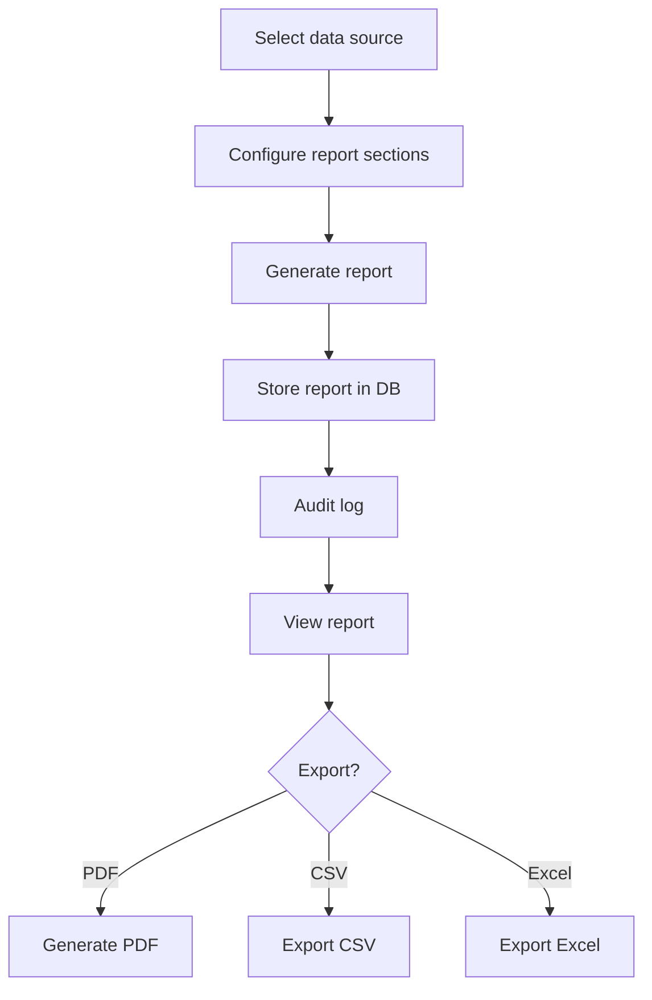

# Report Generation Workflow

> **Version**: 1.0.0  
> **Last Updated**: 2026-07-30  
> **Status**: Active  
> **Owner**: Product Manager

---

## Purpose

Document the report generation and export workflow.

## Scope

Report creation, export formats, and scheduling.

## Audience

Analysts and developers.

---

## 1. Workflow

## 2. Permissions

- Generate: `reports.generate`
- View: `reports.view`
- Export: `reports.export`

## 3. Export Formats

| Format | Content |
|--------|--------|
| PDF | Formatted document with charts and tables |
| CSV | Raw data in comma-separated format |
| Excel | Spreadsheet with formatting |

## 4. Scheduled Reports

Reports can be scheduled via the Scheduler module:
- Daily, weekly, monthly recurrence
- Background job via APScheduler
- Notification on completion

## Related Documents

- [../studios/reporting.md](../studios/reporting.md) — Reporting Studio
- [../backend/background-jobs.md](../backend/background-jobs.md) — Background jobs
- [dashboard-generation.md](dashboard-generation.md) — Dashboard generation
